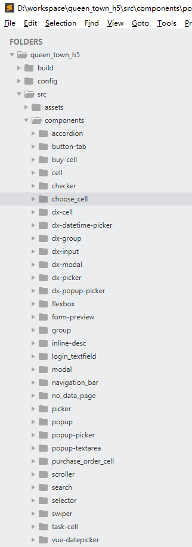

# Component (组件) 进阶

Component 是非常常见的，在我们的Web开发中，只要是生产环境的项目，就一定会有Component. 

下面就是我们的一个实际项目中的例子， 这个项目我们只做了两个月，里面就发展到了32个component. 如下图所示：



很多时候，我们甚至会看到 一个 component 中嵌套着另一个， 这个component再嵌套另外5个.... 

例如： 

`popup-picker` 这个component中，看起来是这样的: 

```
<template>
  <div>
      <popup
	      class="vux-popup-picker"
	      :id="`vux-popup-picker-${uuid}`"
	      @on-hide="onPopupHide"
	      @on-show="onPopupShow">

          <picker
	          v-model="tempValue"
	          @on-change="onPickerChange"
	          :columns="columns"
	          :fixed-columns="fixedColumns"
	          :container="'#vux-popup-picker-'+uuid"
	          :column-width="columnWidth">
          </picker>
      </popup>
  </div>
</template>
<script>
import Picker from '../picker'
import Popup from '../popup'
...
</script>
```

可以看到，这个component中，还包含了另外两个，一个是`popup`, 一个是 `picker`.  

这个时候，新人往往会眼花缭乱。 如果看到 `this.$emit` ， 就更晕了。 

所以，要做好实际项目，同学们一定要学好本章。 

## Component 命名规则

每个component 的命名，官方建议使用 小写字母 + 横线的形式，例如：

```
Vue.component('my-component-name', { /* ... */ })
```

这个是符合W3C的规范的。

也可以定义为： 

```
Vue.component('MyComponentName', { /* ... */ })
```

这个时候，可以使用 `<MyComponentName/>` 来调用，也可以使用 `<my-component-name/>` 来调用。

## Prop 命名规则

同 component， 建议使用 小写字母 + '-' 连接。

## Prop 可以有多种类型。 

下面是一个例子，可以看出，一个component的 prop 可以有多种类型， 包括： 字符串，数字，bool, 数组，和 Object. 

```
props: {
  title: "Triple Body",
  likes: 38444,
  isPublished: true,
  commentIds: [30, 54, 118, 76],
  author: {
  	name: "Liu Cixin", 
  	sex: "male"
  }
}
```

## 可以动态为 prop 赋值

例如，这是个静态的赋值：

```
<blog-post title="Vuejs的学习笔记"></blog-post>
```

这是个动态的赋值：

```
// 1. 在script中定义
post = {
	title: 'Triple body',
	author: {
		name: "Big Liu",
		sex: 'male'
	}
}

// 2. 在模板中使用。 
<blog-post v-bind:title="post.title + 'by' + post.author.name"></blog-post>
```

赋值的时候，只要是符合标准的类型，都可以传入（包括String, bool, array 等）. 

## 使用Object来为Prop赋值

假设，我们定义有：

```
post = {
	author: {
		name: "Big Liu",
		sex: 'male'
	}
}
```

那么，下面的代码：

```
<blog-post v-bind:author></blog-post>
```

等价于：

```
<blog-post v-bind:name="author.name" v-bind:sex="author.sex"></blog-post>
```

## 单向的数据流

当“父页面” 引用一个“子组件”时， 如果父页面中的变量发生了变化，那么对应的“子组件”也会发生页面的更新。  

反之则不行。

## Prop的验证

Vuejs 的组件的Prop , 是可以被验证的。 如果验证不匹配，浏览器的 console就会弹出警告（warning). 这个对于我们的开发非常有利。

我们下面的代码： 

```
Vue.component('my-component', {
	props: {
		name: String,   				 
		sexandheight: [String, Number],
		weight: Number,
		sex: {
			type: String,
			default: 'male'
		}
	}
})
```

可以看得出，

name: 必须是字符串
sexandheight: 必须是个数组。 第一个元素是String, 第二个元素是Number
weight: 必须是Number
sex: 是个String, 默认值是 'male'

支持的类型有： 

- String
- Number
- Boolean
- Array
- Object
- Date
- Function
- Symbol

## Non Prop (非Prop) 的属性

很多时候，component的作者无法预见到应该用哪些属性， 所以Vuejs在设计的时候，就支持让 component接受一些没有预先定义的 prop.  例如：

```
Vue.component('my-component', {
	props: ['title']
})

<my-component title='三体' second-title='第二册： 黑暗森林'></my-component>
```

上面的 `title` 就是预先定义的 "Prop",  `second-title` 就是“非Prop”

我们想传递一个 non-pro, 非常简单， prop 怎么传， non-prop 就怎么传。

## 对于Attribute的合并和替换

如果component中定义了一个 attribute,  例如： 

```
<template>
	<div color="red">我的最终颜色是蓝色</div>
</template>
```

如果在引用了这个“子组件”的“父页面”中，也定义了同样的attribute, 例如：

```
<div>
	<my-component color="blue"></my-component>
</div>
```

那么，父页面传递进来的 `color="blue"` 就会替换子组件中的 `color="red"`

但是，对于 `class` 和 `style` 是例外的。 对于上面的例子， 如果attribute换成 `class`, 那么最终component中的class的值，就是 "red blue" (发生了合并)

## 避免 子组件的attribute 被父页面 所影响

根据上面的小结， 我们知道了 “父页面”的值总会“替换” “子组件”中的同名attribute .

如果不希望有这样的情况的话，我们就可以在定义 component的时候， 这样做：

```
Vue.component('my-component', {
  inheritAttrs: false,
  // ...
})
```


