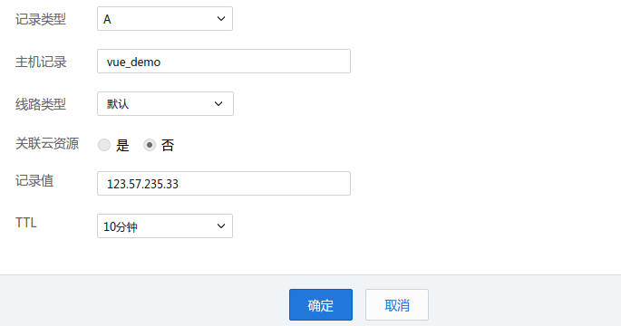

# 打包和部署

## 打包

直接使用下面命令,就可以把vue项目打包:

```
$ npm run build
```

如下:

```
siwei@siwei-linux:/workspace/test_vue_0613$ npm run build

> test_vue_0613@1.0.0 build /workspace/test_vue_0613
> node build/build.js

⠦ building for production...
Starting to optimize CSS...
Processing static/css/app.32ddfe6eea5926f8e3c760d764fef3fa.css...
Processed static/css/app.32ddfe6eea5926f8e3c760d764fef3fa.css, before: 142, after: 74, ratio: 52.11%
Hash: f89cd58bdaf8a153e13e
Version: webpack 2.6.1
Time: 18658ms
                                                  Asset       Size  Chunks             Chunk Names
                  static/js/app.d8b9f437c302a7070fe7.js     9.1 kB       0  [emitted]  app
               static/js/vendor.33c767135f1684f458a7.js     122 kB       1  [emitted]  vendor
             static/js/manifest.75e2ba037e0bc6934514.js    1.51 kB       2  [emitted]  manifest
    static/css/app.32ddfe6eea5926f8e3c760d764fef3fa.css   74 bytes       0  [emitted]  app
              static/js/app.d8b9f437c302a7070fe7.js.map    63.5 kB       0  [emitted]  app
static/css/app.32ddfe6eea5926f8e3c760d764fef3fa.css.map  623 bytes       0  [emitted]  app
           static/js/vendor.33c767135f1684f458a7.js.map     950 kB       1  [emitted]  vendor
         static/js/manifest.75e2ba037e0bc6934514.js.map    14.6 kB       2  [emitted]  manifest
                                             index.html  522 bytes          [emitted]

  Build complete.

  Tip: built files are meant to be served over an HTTP server.
  Opening index.html over file:// won't work.

```


可以看到, 所有的 .vue 文件,都被打包编译成了下面的文件:

```
$ find ./dist
.
./static
./static/css
./static/css/app.32ddfe6eea5926f8e3c760d764fef3fa.css
./static/css/app.32ddfe6eea5926f8e3c760d764fef3fa.css.map
./static/js
./static/js/vendor.33c767135f1684f458a7.js.map
./static/js/app.d8b9f437c302a7070fe7.js.map
./static/js/manifest.75e2ba037e0bc6934514.js
./static/js/manifest.75e2ba037e0bc6934514.js.map
./static/js/app.d8b9f437c302a7070fe7.js
./static/js/vendor.33c767135f1684f458a7.js
./index.html
```

其中, 包括了 js, css , map 和 index.html

我们需要把它放到 http 服务器上,例如: nginx , apache.

## 部署

### 1. 上传代码到远程服务器

我们使用 scp 或者 ftp方式,可以把代码上传到服务器, 假设我们的服务器是 linux,

- 路径是 :  /opt/app/test_vue
- 服务器ip:  123.255.255.33
- 服务器ssh端口: 6666
- 服务器用户名: root


```
$ scp -P 6666 -r dist root@123.255.255.33:/opt/app
index.html                                      100%  528     0.5KB/s   00:00
app.32ddfe6eea5926f8e3c760d764fef3fa.css        100%   74     0.1KB/s   00:00
app.32ddfe6eea5926f8e3c760d764fef3fa.css.map    100%  623     0.6KB/s   00:00
vendor.33c767135f1684f458a7.js.map              100%  927KB 927.3KB/s   00:00
app.d8b9f437c302a7070fe7.js.map                 100%   63KB  62.6KB/s   00:00
manifest.75e2ba037e0bc6934514.js                100% 1511     1.5KB/s   00:00
manifest.75e2ba037e0bc6934514.js.map            100%   14KB  14.3KB/s   00:00
app.d8b9f437c302a7070fe7.js                     100% 9323     9.1KB/s   00:00
vendor.33c767135f1684f458a7.js                  100%  119KB 118.7KB/s   00:00
```

这样,就把本地的 <vue_project>/dist 目录,上传到了远程的 /opt/app目录上.

### 2. 配置远程服务器

登陆远程服务器:

```
$ ssh root@123.255.255.23 -p 6666
(输入密码)

Welcome to Ubuntu 14.04.4 LTS (GNU/Linux 3.13.0-86-generic x86_64)
....

root@my_server:~#

```

把刚才上传的文件夹重命名成: vue_demo:

```
# mv /opt/app/dist /opt/app/vue_demo
```

配置nginx, 使 域名: `vue_demo.siwei.me` 指向该位置:

把下面代码,加入到nginx的配置文件中(`/etc/nginx/nginx.conf`)

```
  server {
          listen       80;
          server_name  vue_demo.siwei.me;
          client_max_body_size       500m;
          charset utf-8;
          root /opt/app/vue_demo;
  }

```

重启nginx之前,测试一下刚才加入的代码是否有问题:

```
# nginx -t
nginx: the configuration file /etc/nginx/nginx.conf syntax is ok
nginx: configuration file /etc/nginx/nginx.conf test is successful
```

可以看到,没问题.然后重启nginx :

```
# nginx -s stop
# nginx
```


### 3. 修改域名配置

nginx跑起来之后, 我们就要配置域名. 否则无法访问.

我们需要增加个二级域名:  vue_demo.siwei.me

以dnspod为例, 需要设置这个二级域名的: A记录. IP地址:



保存.

回到命令行, 输入 ping 命令,确认:

```
$ ping vue_demo.siwei.me
PING vue_demo.siwei.me (123.57.235.33) 56(84) bytes of data.
64 bytes from 123.57.235.33: icmp_seq=1 ttl=54 time=5.79 ms
64 bytes from 123.57.235.33: icmp_seq=2 ttl=54 time=6.38 ms
64 bytes from 123.57.235.33: icmp_seq=3 ttl=54 time=9.25 ms
```

说明 我的二级域名 `vue_demo.siwei.me` 已经可以正常指向到 我的服务器ip了.

### 部署完成!

打开浏览器, 访问 http://vue_demo.siwei.me 即可看到:


