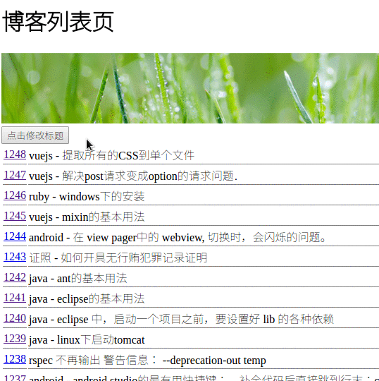

# Component 组件

组件是 Vuejs中最最重要的部分之一. 学号需要一定的时间投入。 

在 "webpack" 项目中，每一个页面文件( .vue) 都可以认为是一个组件.

在Vuejs 1.x中, 组件跟 视图 是分别放到不同的文件夹下面的.

在Vuejs 2.8以后, 所有的视图文件,都保存到 'components' 目录下.

可见 "组件" 这个概念已经越来越重要和普及了.

## 说明

这里说的内容, 跟 官方文档的"[原始组件](https://cn.vuejs.org/v2/guide/single-file-components.html)" 不是一个东西.

本章的内容,仅使用于" webpack 项目"中的组件. 对应的文档是: [单文件组件](https://cn.vuejs.org/v2/guide/single-file-components.html)

## 如何查看文档

1. 先快速，粗糙的查看"原始组件": https://cn.vuejs.org/v2/guide/single-file-components.html

对所有的概念有所了解. (因为这个原始组件的开发环境跟 webpack下项目的开发环境不太一样, 所以很多以 webpack 作为入门的同学(例如本书读者) 会蒙圈)

2. 再看 "单文件组件" : https://cn.vuejs.org/v2/guide/single-file-components.html, 就可以对 webpack项目下的组件有清晰的认识.

3. 遇到问题之后,再看 "原始组件", 这里包括很多API级别的概念和解释.

## Component的重要作用: 重用代码

我们可以想象一个场景: 有两个页面, 每个页面的头部都要有个LOGO图片.

那么我们每次都写成原始HTML的话, 代码会比较重复:

页面1的代码如下:

```
  <div class='logo'>
    
  </div>
  页面1的其他代码
```

页面2的代码如下:

```
  <div class='logo'>
    
  </div>
  页面2的其他代码
```

所以,我们应该把这段代码抽取出来,成为一个新的组件(component).

## 组件的创建

新建一个文件: `src/components/Logo.vue`

```
<template>
  <div class='logo'>
    
  </div>
</template>
```

这个文件定义了一个最最简单的component.

然后,修改对应的页面:

```
<template>
  <div >
    <my-logo>
    </my-logo>
		...
</template>

<script>
import MyLogo from '@/components/Logo'

export default {
	...
  components: {
    MyLogo
  }
}
```

注意1: 上面代码中的`components: { MyLogo } ` , 必须是这个写法,它等同于:

```
components: {
  MyLogo: MyLogo   // 前面的MyLogo 是template中的名字
                  // 后面的MyLogo 是import进来的代码.
}
```

注意2: 上面代码中定义的组件， 虽然名字叫做 `MyLogo`, 但是在 `<template/>` 中使用的时候，需要写作 `<my-logo></my-logo>`. 


保存代码，我们刷新一下，发现两个页面都发生了变化, 如下图:


## 向组件中传递参数

如果我们希望两个页面, 每个页面都有个title, 但是内容不同, 该怎么办? 就需要传递参数给Component了.

声明组件的时候, 我们需要这样:

修改文件: `src/components/Logo.vue`

```
<template>
  <div class='logo'>
    <h1>{{title}}</h1>
		...
  </div>
</template>

<script>
export default {
  props: ['title']    // 加上了这个声明.
}
</script>
```

可以看到，上面的代码中， 增加了这么几行代码：  

```
export default {
  props: ['title']
}
```

上面的代码表示， 为该Component 增加了一个 "property(属性)", 属性的名字叫做 "title". 

### 组件接收字符串作为参数

在调用的时候, 传递字符串:

```
<my-logo title="博客列表页">
</my-logo>
```

就可以了.

### 组件接收变量作为参数

如果要传递的参数是一个变量, 就要这么写:

```
<template>
    <my-logo :title="title">
    </my-logo>
    <input type='button' @click='change_title' value='点击修改标题'/><br/>
</template>

<script>
export default {
  data: function() {
    return {
      title: '博客列表页',
    }
  },
  methods: {
    change_title: function(){
      this.title = '好多文章啊(标题被代码修改过了)'
    }
  },
</script>
```

如下图:



## 脱离Webpack , 在原生Vuejs中创建 Component

非常简单。 如下面代码所示：

```
<html>
<head>
  <script src="https://cdn.jsdelivr.net/npm/vue@2.5.16/dist/vue.js"></script>
</head>
<body>
  <div id='app'>
    <study-process></study-process>
  </div>
  <script>
    Vue.component('study-process', {
      data: function () {
        return {
          count: 0
        }
      },
      template: '<button v-on:click="count++">我学习到了第 {{ count }} 章.</button>'
    })
    var app = new Vue({
      el: '#app', 
      data: {
      }
    })
  </script>
</body>
</html>
```

该代码首先声明了一个component: 

```
    Vue.component('study-process', {
      data: function () {
        return {
          count: 0
        }
      },
      template: '<button v-on:click="count++">我学习到了第 {{ count }} 章.</button>'
    })
```

可以看出，该component 中定义了一个 `data` 代码段， 里面有个变量 `count`.  

然后定义一个 `template`段落即可。


