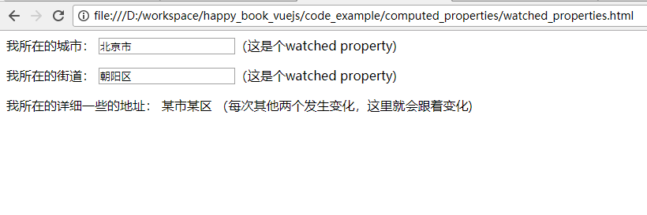
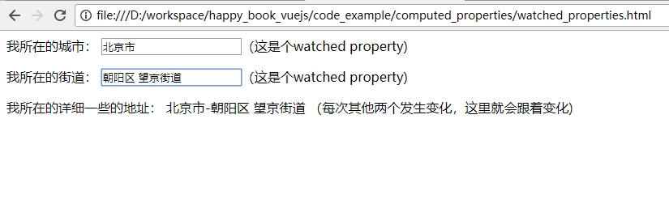

# 使用Computed properties(计算得到的属性)和watchers(监听器) 

很多时候，我们在页面上想要显示某个变量的值时，都需要经过一些计算， 例如： 

```
<div id="example">
  {{ some_string.split(',').reverse().join('-') }}
</div>
```

越是复杂，到后期越容易出错。 

这个时候，我们就需要一种机制，可以方便的创建这样的通过计算得来的数据。  

所以， Computed Properties 就是我们的解决方案。

## 典型例子

```
<html>
<head>
	<script src="https://cdn.jsdelivr.net/npm/vue@2.5.16/dist/vue.js"></script>
</head>
<body>
	<div id='app'>
		<p> 原始字符串： {{my_text}} </p>
		<p> 通过运算后得到的字符串： {{my_computed_text}} </p>
	</div>
	<script>
		var app = new Vue({
			el: '#app',
			data: {
				my_text: 'good good study, day day up'
			},
			computed: {
				my_computed_text: function(){
					// 先去掉逗号，然后按照空格分割成数组，然后翻转，并用'-'来连接
					return this.my_text.replace(',', '').split(' ').reverse().join('-')
				}
			}

		})
	</script>
</body>
</html>
```

可以看到，上面的关键代码是，在 Vue的构造函数中， 传入一个 `computed`的段落。 

使用浏览器运行后，可以看到结果如下图所示：


我们也打开 console 来查看。 

输入
```
> app.my_text    
```
会得到：  "good good study, day day up"

输入

```
> app.my_computed_text
```
会得到转换后的： "up-day-day-study-good-good"

## Computed Properties 与 普通方法的区别。

根据上面的例子，我们可以使用 普通方法来实现： 

```
<html>
<head>
	<script src="https://cdn.jsdelivr.net/npm/vue@2.5.16/dist/vue.js"></script>
</head>
<body>
	<div id='app'>
		<p> 原始字符串： {{my_text}} </p>
		<p> 通过运算后得到的字符串： {{my_computed_text() }} </p>
	</div>
	<script>
		var app = new Vue({
			el: '#app',
			data: {
				my_text: 'good good study, day day up'
			},
			methods: {
				my_computed_text: function(){
					return this.my_text.replace(',', '').split(' ').reverse().join('-') + '，我来自于 function, 不是computed '
				}
			}
		})
	</script>
</body>
</html>
```

上面的代码，运行后如下图所示： 


可以发现，他们达到的效果是一样的。 

他们的区别在于：  使用computed properties的方式，会把结果“缓存”起来。  每次调用对应的computed properties时，只要对应的依赖数据没有改动， 
那么就不会变化。 

而使用 "function" 实现的版本，则不存在缓存问题。 每次都会重新计算对应的数值。 

所以， 我们需要按照实际情况，来选择是使用 "computed properties" ， 还是使用普通function的形式。


## computed property 与 watched property 的区别

Vuejs 中的property(属性)， 是可以要么根据计算发生变化（computed) , 要么根据监听（watch)其他的变量的变化而发生变化

我们看一下，如何根据监听（watch) 其他的变量而自身发生变化的例子， 如下；


```
<html>
<head>
	<script src="https://cdn.jsdelivr.net/npm/vue@2.5.16/dist/vue.js"></script>
</head>
<body>
	<div id='app'>
		<p> 
			我所在的城市： <input v-model='city' />（这是个watched property)
		</p>
		<p> 
			我所在的街道： <input v-model='district' />（这是个watched property)
		</p>
		<p> 我所在的详细一些的地址： {{full_address}} （每次其他两个发生变化，这里就会跟着变化) </p>
	</div>
	<script>
		var app = new Vue({
			el: '#app',
			data: {
				city: '北京市',
				district: '朝阳区',
				full_address: "某市某区"
			},
			watch: {
				city: function(city_name){
					this.full_address = city_name + '-' + this.district
				},
				district: function(district_name){
					this.full_address = this.city + '-' + district_name
				}
			}

		})
	</script>
</body>
</html>
```

在上面的代码中， 可以看到， `watch: { city: ..., district: ...}`, 表示， `city` 和 `district` 都已经被监听了， 这两个都是 `watched properties`.

只要`city` 和 `district`发生变化， `full_address` 就会跟着变化。 

我们用浏览器打开上面的代码，如下图所示，此时 由于 `city` 和`district` 还没有发生变化，所以 `full_address`的值还是 "某市某区" ： 



当我在 “街道” 的输入框， 后面加上 “望京街道” 几个字后，可以看到， 下面的“详细地址”， 就发生了变化。 如下图所示： 



### 使用computed 会比watch 更加简洁

上面的例子，我们可以使用 `computed` 来改写， 如下图所示： 

```
<html>
<head>
	<script src="https://cdn.jsdelivr.net/npm/vue@2.5.16/dist/vue.js"></script>
</head>
<body>
	<div id='app'>
		<p> 
			我所在的城市： <input v-model='city' />（这是个watched property)
		</p>
		<p> 
			我所在的街道： <input v-model='district' />（这是个watched property)
		</p>
		<p> 我所在的详细一些的地址： {{full_address}} （每次其他两个发生变化，这里就会跟着变化) </p>

	</div>
	<script>
		var app = new Vue({
			el: '#app',
			data: {
				city: '北京市',
				district: '朝阳区',
			},
			computed: {
				full_address: function(){
					return this.city + this.district;
				}
			}
		})
	</script>
</body>
</html>
```

可以看到， 方法少了一个 ， `data`中定义的属性也少了一个，简洁了不少。 代码简洁，维护起来就容易（代码量越少，程序越好理解）