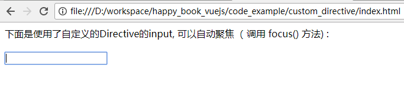
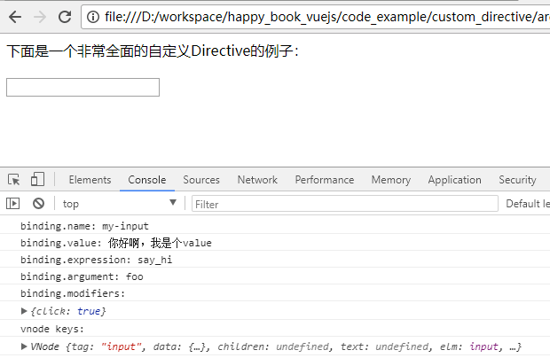

# 自定义 Directive

Vuejs除了自身提供的 `v-if`, `v-model` 等标准的Directive之外， 还提供了非常强大的自定义功能。 使用这个功能，我们就可以定义属于我们自己的Directive.  

## 例子

我们看下面例子：

```
<html>
<head>
	<script src="https://cdn.jsdelivr.net/npm/vue@2.5.16/dist/vue.js"></script>
</head>
<body>
	<div id='app'>
		下面是使用了自定义的Directive的input, 可以自动聚焦（ 调用 focus() 方法) : <br/>
		<br/>
		<input v-myinput/>
	</div>
	<script>
		var app = new Vue({
			el: '#app',
			directives: {
				"myinput": {
					inserted: function(element){
						element.focus()
					}
				}
			}
		})
	</script>
</body>
</html>
```

上面的代码中， 先是在 Vue中，定义了一个 `directives` 代码段： 

```
directives: {
	myinput: {
		inserted: function(element){
			element.focus()
		}
	}
}
```

- `myinput` 就是自定义Directive的名字。  使用的时候就是 `v-myinput`. 
- `inserted`: 这是一个定义好的方法（钩子方法），表示在页面被Vuejs渲染的过程中， 在该DOM被 "insert"（插入）到页面中的时候，被触发。
触发的内容是 `element.focus()`


用浏览器打开后，可以看到`<input/>` 标签是会自动聚焦的。 这个时候用户就可以直接输入内容了。 如下图所示：



如果在 "webpack" 等可以修改 “全局Vue实例”的时候，也可以使用这样的方法： 

```
Vue.directive('myinput', {
  inserted: function (elemenet) {
    element.focus()
  }
})
```

## 自定义Directive的命名方法

如果您希望把 `v-myinput`的调用，写成 `v-my-input`， 那么在定义的时候，就应该： 

```
directives: {
	// 注意下面的写法. 使用双引号括起来 
	"my-input": {    
		inserted: function(element){
			element.focus()
		}
	}
}
```

那么我们就可以在View中这样使用了： 

```
<input v-my-input />
```

## 钩子方法 (Hook Functions)

我们在上面的例子中，知道了 `inserted` 是一个钩子方法。  下面是一个完整的列表： 

- `bind`  只运行一次。 当该元素首次被渲染的时候。（绑定到页面的时候） 
- `inserted`  该元素被插入到父节点的时候（也可以认为是该元素被Vue渲染的时候）
- `update`  该元素被更新的时候。
- `componentUpdated`  包含的component被更新的时候。
- `unbind`  只会运行一次。 当该元素被Vuejs从页面解除绑定的时候。 

## 自定义Directive可以接收到的参数

Vuejs 为自定义Directive 实现了强大了功能， 可以接收很多个参数。 下面是个例子：

```
<html>
<head>
	<script src="https://cdn.jsdelivr.net/npm/vue@2.5.16/dist/vue.js"></script>
</head>
<body>
	<div id='app'>
		下面是一个非常全面的自定义Directive的例子： <br/>
		<br/>
		<input v-my-input:foo.click="say_hi" />
	</div>
	<script>
		var a 
		var app = new Vue({
			el: '#app',
			data: {
				say_hi: '你好啊，我是个value'
			},
			directives: {
				"my-input": {
					inserted: function(element, binding, vnode){
						element.focus()
						console.info("binding.name: " + binding.name)
						console.info("binding.value: " + binding.value)
						console.info("binding.expression: " + binding.expression)
						console.info("binding.argument: " + binding.arg)
						console.info("binding.modifiers: ")
						console.info(binding.modifiers)
						console.info("vnode keys:")
						console.info(vnode)
					}
				}
			}
		})
	</script>
</body>
</html>
```

先看运行结果： 



在上图中，可以看到， 自定义Directive 在声明的时候，接收了3个参数：  `function(element, binding, vnode)`

通过这三个参数，就可以看到很多对应的内容，包括 `binding.name`, `binding.value`, `binding.expression`. 他们的含义都是字面的意思。

借助这些内容，我们可以实现我们自己想要的Directive.  

## 实战经验

1.优先考虑使用Component. 

考虑到维护成本。 它的作用跟 JSP 中的自定义标签是一样的。  与其使用 Directive, 不如使用 Component. 

2.如果一定要用，把它实现的尽量简单。 

如果接手的新人水平不如你，那他很可能读不懂这块代码。


