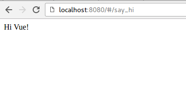
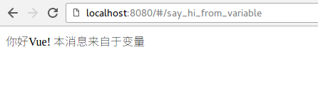

# 创建一个页面

创建页面需要两步：

1. 新建路由
2. 新建vue页面


## 新建一个路由

路由文件是 `src/router/index.js`, 打开之后, 我们增加两行:

```
import Vue from 'vue'
import Router from 'vue-router'

// 增加这一行, 作用是引入 SayHi 这个component
import SayHi from '@/components/SayHi'

Vue.use(Router)
export default new Router({
  routes: [

    // 增加下面几行, 表示定义了  /#/say_hi 这个url
    {
      path: '/say_hi',
      name: 'SayHi',
      component: SayHi
    },
  ]
})
```

## 创建一个新的component

我们要创建 `src/components/SayHi.vue`, 这个文件.

如下:

```
<template>
  <div >
    Hi Vue!
  </div>
</template>

<script>
export default {
  data () {
    return { }
  }
}
</script>

<style>
</style>

```

现在,我们可以直接访问  http://localhost:8080/#/say_hi 这个链接了. 效果如下图.




- `<template></template>` 代码块中,表示的是 HTML模板.
- `<script>`表示的是 js 代码. 所有的js代码都写在这里.
- `<style>`表示所有的 CSS/SCSS/SASS 文件都可以写在这里.

## 为页面增加一些样式

例如,我们可以把页面加一些样式:

```

<template>
  <div class='hi'>
    Hi Vue!
  </div>
</template>

<script>
export default {
  data () {
    return { }
  }
}
</script>

<style>
.hi {
  color: red;
  font-size: 20px;
}
</style>
```

注意上面代码中的　`<style>`标签，里面跟普通的CSS一样定义了样式。

可以看到, 文字加了颜色, 如下图:


## 在页面中定义并显示变量

如果要在vue页面中定义一个变量,并把它显示出来,就需要事先在 `data` 中定义:
(具体步骤见注释)

```
<template>
  <div>
    <!--  步骤2: 在这里显示 message -->
    {{message}}
  </div>
</template>

<script>
export default {
  data () {
    return {
      // 步骤1: 这里定义了变量 message 的初始值
      message: '你好Vue! 本消息来自于变量'
    }
  }
}
</script>

<style>
</style>
```

页面打开如下图所示:


