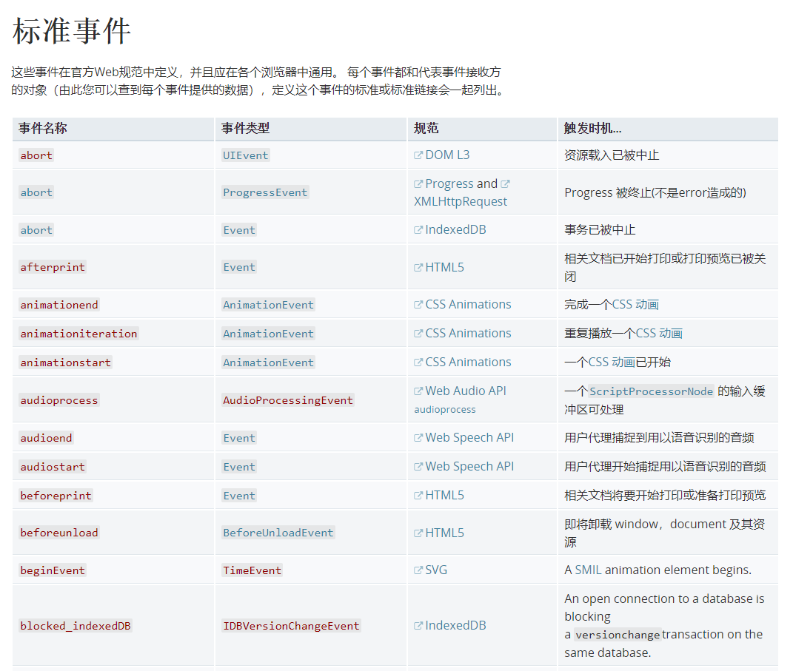
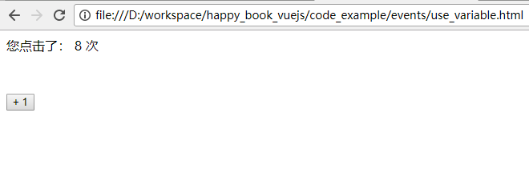
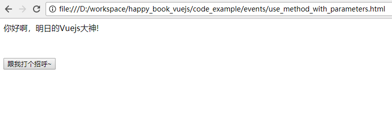
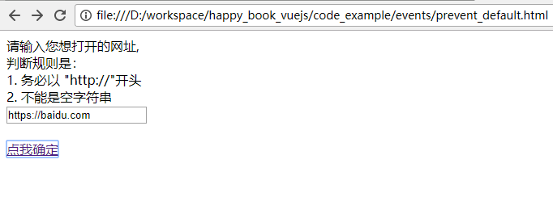
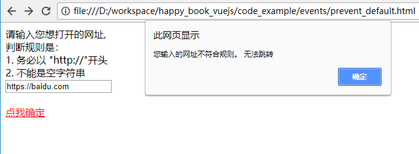

# 事件处理 (Event)

Vuejs中的事件处理非常强大， 也非常重要。 我们一定要学好它。

## 支持的Event 

我们在前面曾经看到过 `v-on:click`, 那么，都有哪些事件可以被`v-on`所支持呢？ 

只要是标准的HTML定义的Event, 都是被Vuejs支持的。 

- focus  （元素获得焦点)
- blur    (元素失去焦点)
- click  （单击 鼠标左键）
- dblclick (双击鼠标左键)
- contextmenu (单机鼠标右键)
- mouseover  (指针移到有事件监听的元素或者它的子元素内)
- mouseout   (指针移出元素，或者移到它的子元素上)
- keydown   （键盘动作： 按下任意键) 
- keyup     (键盘动作： 释放任意键)

可以来这里查看 [所有HTML标准事件](https://developer.mozilla.org/zh-CN/docs/Web/Events)

总共定义了 162个标准事件， 和 几十个非标准事件，以及 Mozilla的特定事件。  如下图所示：



我们不用全部都记住，通常在日常开发中，只有不到20个是最常见的event. 

## 使用 v-on 进行事件的绑定

我们可以认为，几乎所有的事件，都是由 `v-on` 这个 directive 来驱动的。 所以，本节会对 `v-on` 有更加详尽的说明。

### 1. 在 v-on 中使用变量

如下面代码所示，可以在 `v-on` 中引用变量： 

```
<html>
<head>
	<script src="https://cdn.jsdelivr.net/npm/vue@2.5.16/dist/vue.js"></script>
</head>
<body>
	<div id='app'>
		您点击了： {{ count }} 次
		<br/>
		<button v-on:click='count += 1' style='margin-top: 50px'> + 1</button>
	</div>

	<script>
		var app = new Vue({
			el: '#app', 
			data: {
				count: 0
			}
		})
	</script>
</body>
</html>
```

上面的代码，用浏览器打开后， 点击 按钮， 就可以看到 `count` 这个变量会随之 +1. 如下图所示： 



### 2. 在 v-on 中使用方法名

上面的例子，也可以按照下面的写法来实现：

```
<html>
<head>
	<script src="https://cdn.jsdelivr.net/npm/vue@2.5.16/dist/vue.js"></script>
</head>
<body>
	<div id='app'>
		您点击了： {{ count }} 次
		<br/>
		<button v-on:click='increase_count' style='margin-top: 50px'>  + 1 </button>
	</div>

	<script>
		var app = new Vue({
			el: '#app', 
			data: {
				count: 0
			}, 
			methods: {
				increase_count: function(){
					this.count += 1
				}
			}
		})
	</script>
</body>
</html>
```

可以看到，在 `v-on:click='increase_count'` 中， `increase_count` 就是一个方法名。 

### 3. 在v-on 中使用方法名 + 参数

我们也可以直接使用 `v-on:click='some_function("your_parameter")'` 这样的写法，如 下面的例子所示： 


```
<html>
<head>
	<script src="https://cdn.jsdelivr.net/npm/vue@2.5.16/dist/vue.js"></script>
</head>
<body>
	<div id='app'>
		{{ message }}
		<br/>
		<button v-on:click='say_hi("明日的Vuejs大神")' style='margin-top: 50px'> 跟我打个招呼~ </button>
	</div>

	<script>
		var app = new Vue({
			el: '#app', 
			data: {
				message: "这是个 在click中调用 方法 + 参数的例子"
			},
			methods: {
				say_hi: function(name){
					this.message = "你好啊，" + name + "!"
				}
			}
		})
	</script>
</body>
</html>
```

使用浏览器打开后，点击按钮，就可以看到下图所示：



### 4. 重新设计按钮的逻辑

我们在实际开发中，往往会遇到这样的情况： 点击某个按钮，或者触发某个事件后，希望概念 按钮的默认状态。

最典型的例子： 提交表单(<form/>)的时候，我们希望先对该表单进行验证。 如果验证不通过，该表单就不要提交。 

这个时候，如果希望表单不要提交，我们就要让 这个 submit 按钮，不要有下一步的动作。 在所有的开发语言当中，都会有一个对应的方法，叫做： "preventDefault"
(停止默认动作)

我们看这个例子：


```
<html>
<head>
	<script src="https://cdn.jsdelivr.net/npm/vue@2.5.16/dist/vue.js"></script>
</head>
<body>
	<div id='app'>

		请输入您想打开的网址,   	<br/>
		判断规则是： 				<br/>
		1. 务必以 "http://"开头 	<br/>
		2. 不能是空字符串			<br/>
		<input v-model="url" placeholder="请输入 http:// 开头的字符串, 否则不会跳转" /> <br/>
		<br/>
		<a v-bind:href="this.url" v-on:click='validate($event)'> 点我确定 </a>
	</div>

	<script>
		var app = new Vue({
			el: '#app', 
			data: {
				url: ''
			}, 
			methods: {
				validate: function(event){
					if(this.url.length == 0 || this.url.indexOf('http://') != 0){
						alert("您输入的网址不符合规则。 无法跳转")
						if(event){
							alert("event is: " + event)
							event.preventDefault()
						}   
					}
				}
			}
		})
	</script>
</body>
</html>
```

上面的代码中，可以看到，我们定义了一个变量： `url`.  并且通过代码： 

`<a v-bind:href="this.url" v-on:click='validate($event)'> 点我确定 </a>` 做了两件事情： 

1. 把 `url` 绑定到了该元素上。
2. 该元素 在触发 `click`事件时，会调用 `validate`方法。 该方法传递了一个特殊的参数： `$event`. 该参数是当前 事件的一个实例。（MouseEvent)

在 `validate`方法中，我们是这样定义的：  先验证是否符合规则。 如果符合，放行，会继续触发 `<a/>` 元素的默认动作（让浏览器发生跳转） 。 否则的
话，会弹出一个 "alert" 提示框。 


用浏览器打开这段代码，可以看到下图所示：



我们先输入一个合法的地址： http://baidu.com  ， 可以看到，点击后，页面发生了跳转。 跳转到了百度。 

我们再输入一个 “不合法”的地址：  https://baidu.com  注意： 该地址不是以 "http://" 开头，所以我们的vuejs 代码不会让它放行。 

如下图所示：



进一步观察，页面也不会跳转（很好的解释了 这个时候 `<a/>` 标签点了也不起作用)