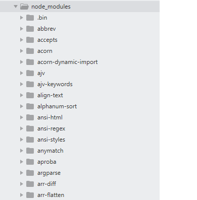

# Webpack下的Vuejs项目文件结构

根据前面章节，我们安装了 webpack, vue-cli, 并运行成功，看到了Vuejs的第一个页面。 

那么首先，我们需要对Webpack 下的Vuejs有个全面的了解。 

在我们运行了命令后，

```
$ vue init webpack my-project
```

会生成一个崭新的项目。 它的文件结构如下：

```
▸ build/                // 编译用到的脚本
▸ config/               // 各种配置
▸ dist/                 // 打包后的文件夹
▸ node_modules/         // node第三方包
▸ src/                  // 源代码
▸ static/               // 静态文件, 暂时无用
  index.html            // 最外层文件
  package.json          // node项目配置文件
```

下面我们针对重要的文件和文件夹来依次说明. 

## build 文件夹

这个文件夹中，保留了各种打包脚本。 是不可或缺的，不要随意修改。

展开后如下：

```
▾ build/
    build.js
    check-versions.js
    dev-client.js
    dev-server.js
    utils.js
    vue-loader.conf.js
    webpack.base.conf.js
    webpack.dev.conf.js
    webpack.prod.conf.js
```

- build.js:

打包使用，不要修改。

- check-versions.js:

检查npm的版本， 不要修改。

- dev-client.js 和 dev-server.js:

是在开发时使用的服务器脚本。不要修改。（借助于node这个后端语言，我们在做vuejs开发时，可以通过 `$npm run dev `这个命令，打开一个小的server, 运行vuejs. )

- utils.js

不要修改。 做一些css/sass 等文件的生成。

- vue-loader.conf.js

非常重要的配置文件，不要修改。 内容是用来辅助加载vuejs用到的css source map等内容。

- webpack.base.conf.js
- webpack.dev.conf.js
- webpack.prod.conf.js

这三个都是基本的配置文件。不要修改。

## config 文件夹

跟部署和配置相关。

```
▾ config/
    dev.env.js
    index.js
    prod.env.js
```

- dev.env.js

开发模式下的配置文件，一般不用修改。

- prod.env.js

生产模式下的配置文件，一般不用修改。

- index.js

很重要的文件， 定义了:

- 开发时的端口（默认是8080），
- 图片文件夹（默认static)，
- 开发模式下的 代理服务器. 我们修改的还是比较多的。

对于这个文件夹的内容，我们会在后续的章节中陆续进行解释（例如对于某个页面的渲染过程，如何做代理转发) 

## dist 文件夹

打包之后的文件所在目录，如下。

```
▾ dist/
  ▾ static/
    ▾ css/
        app.d41d8cd98f00b204e9800998ecf8427e.css
        app.d41d8cd98f00b204e9800998ecf8427e.css.map
    ▾ js/
        app.c482246388114c3b9cf0.js
        app.c482246388114c3b9cf0.js.map
        manifest.577e472792d533aaaf04.js
        manifest.577e472792d533aaaf04.js.map
        vendor.5f34d51c868c93d3fb31.js
        vendor.5f34d51c868c93d3fb31.js.map
    index.html
```

可以看到，对应的css, js, map, 都在这里。

请大家注意 文件名中的无意义的字符串，这个是随机生成的。 目的是为了让文件名发生变化 ，方便我们的部署，也方便Nginx服务器重新对该文件做缓存。

- `app.css` : 编译后 的CSS 文件
- `app.js` : 最核心的js 文件. 几乎所有的代码逻辑都会打包到这里。
- `manifest.js` ： 生成的周边js 文件
- `vendor.js` ： 生成的vendor.js 文件

另外，每个 .map 文件都非常重要。 可以简单的认为，有了 .map 文件，我们的浏览器就可以先下载整个的`.js` 文件，然后在后续的操作中“部分加载” 对应的文件。

切记： 这个文件夹不要放到git中。 因为每次编译之后，这里的文件都会发生变化。

## node_modules 文件夹

node项目所用到的第三方包，特别多，特别大。  `$ npm install` 所产生。 所有在 `package.json` 中定义的第三方包都会出现在这里。

package.json : 

```
  // ...
  "dependencies": {
    "vue": "^2.3.3",
    "vue-resource": "1.3.3",
    "vue-router": "^2.3.1",
    "vuex": "^2.3.1"
  },
  "devDependencies": {
    "autoprefixer": "^6.7.2",
    "babel-core": "^6.22.1",
    "babel-loader": "^6.2.10",
    "babel-plugin-transform-runtime": "^6.22.0",
    "babel-preset-env": "^1.3.2",
    "babel-preset-stage-2": "^6.22.0",
    "babel-register": "^6.22.0",
    //...
  }
  // ...
```

node_modules 文件夹里面往往会有几百个文件夹，看起来如下：



这个文件夹不要放到git中。

## src 文件夹

最最核心的源代码所在的目录。 展开后如下所示（不同版本的vue-cli生成的目录会稍有不同，不过核心都是一样的）：

```
▾ src/
  ▾ assets/
      logo.png
  ▾ components/
      Book.vue
      BookList.vue
      Hello.vue
  ▾ router/
      index.js
    App.vue
    main.js
```

- assets 文件夹

用到的图片都可以放在这里。

- components

用到的"视图"和"组件"所在的文件夹。（最最核心）

- router/index.js  

路由文件。 定义了各个页面对应的url. 

- App.vue

如果index.html 是一级页面模板的话，这个App.vue就是二级页面模板。
所有的其他vuejs页面，都作为该模板的 一部分被渲染出来。

- main.js

没有实际的业务逻辑，但是为了支撑整个vuejs框架，存在很必要。
