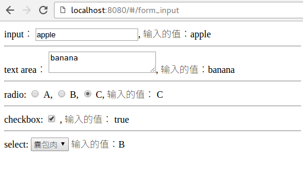
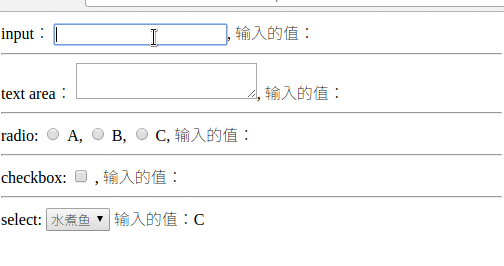

# 表单项目的绑定

基本上，所有的表单项，无论是`<input/>`, 还是 `<textarea/>`，都需要使用 `v-model`来绑定。

## 表单项: input, textarea, select 等．

使用v-model来绑定　输入项

```
<input v-model="my_value" style='width: 400px'/>
```

就可以在代码中获取到　`this.my_value`的值.


## 表单项的完整例子

```
<template>
  <div>

    input： <input type='text' v-model="input_value"/>,
    输入的值：{{input_value}}
    <hr/>
    text area： <textarea v-model="textarea_value"></textarea>,
    输入的值：{{textarea_value}}
    <hr/>
    radio:
    <input type='radio' v-model='radio_value' value='A'/> A,
    <input type='radio' v-model='radio_value' value='B'/> B,
    <input type='radio' v-model='radio_value' value='C'/> C,
    输入的值：
    {{radio_value}}
    <hr/>
    checkbox:
    <input type='checkbox' v-model='checkbox_value'
      v-bind:true-value='true'
      v-bind:false-value='false'
      /> ,
    输入的值：
    {{checkbox_value}}
    <hr/>
    select:
    <select v-model='select_value'>
      <option v-for="e in options" v-bind:value="e.value">
        {{e.text}}
      </option>
    </select>
    输入的值：{{select_value}}

  </div>
</template>

<script>
export default {
  data () {
    return {
      input_value: '',
      textarea_value: '',
      radio_value: '',
      checkbox_value: '',
      select_value: 'C',
      options: [
        {
          text: '红烧肉', value: 'A'
        },
        {
          text: '囊包肉', value: 'B'
        },
        {
          text: '水煮鱼', value: 'C'
        }
      ]
    }
  },
  methods: {
  }
}
</script>
```

对于select 的option, 使用　`v-bind:value`来绑定option的值.


效果如图：　



动图如下：




## Modifiers （后缀词）

### .lazy 

可以让输入后不会立刻变化， 而是等焦点彻底离开后（触发 `blur()`事件后）才会触发视图层的值的变化。 

使用方式： 

```
<input type='text' v-model.lazy="input_value"/>
```

这个可以用在某些需要等待用户输入完字符串才需要给出反应的情况，例如 “搜索” 。

### .number

强制要求输入数字

使用方式： 

```
<input type='text' v-model.lazy="input_value" type="number"/>
```

### .trim 

强制对输入的值进行去掉 前后的空格。

使用方式： 

```
<input type='text' v-model.trim="input_value" />
```