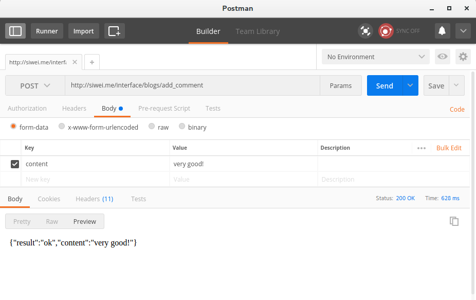
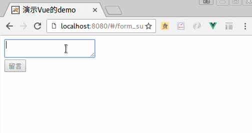

# 表单的提交

大家要切记这一点：　在任何 Single Page App中，js代码都不会产生
一个传统意义的form表单提交！（这会引起整个页面的刷新）

所以，我们往往用事件来实现．（桌面开发思维）

假设，我们在远程有个接口，可以接受别人的留言：

- URL: http://siwei.me/interface/blogs/add_comment
- 参数：　`content`:  留言的内容．
- 请求方式： `POST`
- 返回结果：

```
{"result":"ok","content":"(留言的内容)"}
```

我们可以先用POSTMAN来确认一下:



例如，下面的代码，就是把输入的表单，提交到我们的后台．

文件名: `/src/components/FormSubmit.vue`

```
<template>
  <div>
    <textarea v-model='content'>
    </textarea>
    <br/>
    <input type='button' @click='submit' value='留言'/>
  </div>
</template>
<script>

export default {
  data () {
    return {
      content: ''
    }
  },
  methods: {
    submit: function(){
      this.$http.post('/api/interface/blogs/add_comment',
        {
          content: this.content
        }
      )
      .then((response) => {
          alert("提交成功!, 刚才提交的内容是：" + response.body.content)
        },
        (response) => {
          alert("出错了")
        }
      )
    }
  }
}
</script>
```

路由:

```
export default new Router({
  routes: [
    {
      path: '/form_submit',
      name: 'FormSubmit',
      component: FormSubmit
    }
  ]
} )
```

访问url:   `http://localhost:8080/form_submit` , 如下图:


