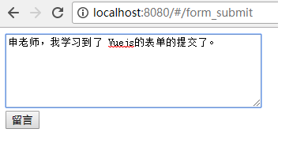

# 表单的提交

大家要切记这一点：　在任何 Single Page App中，js代码都不会产生. 一个传统意义的form表单提交！（这会引起整个页面的刷新）

所以，我们往往用事件来实现．（桌面开发思维）

例如，在远程有个接口，可以接受别人的留言：

- URL: http://siwei.me/interface/blogs/add_comment
- 参数：　`content`:  留言的内容．
- 请求方式： `POST`
- 返回结果：

```
{"result":"ok","content":"(留言的内容)"}
```

我们可以先用POSTMAN来确认一下:


例如，下面的代码，就是把输入的表单，提交到我们的后台．

新增加一个文件: `/src/components/FormSubmit.vue`, 内容如下： 

```
<template>
  <div>
    <textarea v-model='content'>
    </textarea>
    <br/>
    <input type='button' @click='submit' value='留言'/>
  </div>
</template>
<script>

export default {
  data () {
    return {
      content: ''
    }
  },
  methods: {
    submit: function(){
      this.$http.post('/api/interface/blogs/add_comment',
        {
          content: this.content
        }
      )
      .then((response) => {
          alert("提交成功!, 刚才提交的内容是：" + response.body.content)
        },
        (response) => {
          alert("出错了")
        }
      )
    }
  }
}
</script>
```

上面的代码中： 

```
    <textarea v-model='content'>
    </textarea>
```

就是待输入的表单项 。 

```    
<input type='button' @click='submit' value='留言'/>
```
则是按钮，点击后会触发提交表单的函数 `submit`. 


```
    submit: function(){
      this.$http.post('/api/interface/blogs/add_comment',
        {
          content: this.content
        }
      )
      .then((response) => {
          alert("提交成功!, 刚才提交的内容是：" + response.body.content)
        },
        (response) => {
          alert("出错了")
        }
      )
    }
```

上面的代码，定义了提交表单的具体函数 `submit`. 

- `this.$http.post` 表示 发起的http 的类型是 post. 

- `post` 函数的第一个参数是 url, 第二个参数是一个json,  `{ content: this.content}` 代表了我们要提交的数据

- `then`函数的处理同 http get 请求


接下来，我们修改路由文件： `src/router/index.js`, 增加内容如下：

```
import FormSubmit from '@/components/FormSubmit'

export default new Router({
  routes: [
    {
      path: '/form_submit',
      name: 'FormSubmit',
      component: FormSubmit
    }
  ]
} )
```

访问url:   `http://localhost:8080/form_submit` , 输入一段字符串, 如下图所示：



点击提交按钮，就可以看到，内容已经提交，并且得到了返回的response, 触发了 `alert`， 如下图所示：


查看一下返回的json： 

```
{"result":"ok","content":"\u7533\u8001\u5e08\uff0c\u6211\u5b66\u4e60\u5230\u4e86 Vuejs\u7684\u8868\u5355\u7684\u63d0\u4ea4\u4e86\u3002"}
```

至此，完成了一个完整的 输入表单，提交表单的过程。