# Git 在Windows下的使用

在《程序员修炼之道： 从小工到专家》这本书中，提到了一个让程序员非常尴尬的局面： 老板要看进度，结果程序员拿不出来，只好跟老板撒谎： 我的代码被猫吃了。

虽然我们的代码不会被猫吃掉，但是几乎每个程序员都会犯的错误是：在下班的时候突然不小心忘记保存，或者突然断电，结果之前敲了几个小时的代码就没了。

所以，每个程序员必须要对自己的代码做版本控制。 

在2009年之前，国内的人大部分都用 SVN. 在2010年开始，越来越多的人开始使用Git. 

本节专门为 Windows 程序员准备。 因为对于 Linux 和 mac用户来说， Git都是现成的。 一行命令搞定。 所以就不赘述了。

## 为什么要使用 Git Bash

因为Git Bash 不但提供了Git， 还提供了bash , 一种非常不错的类似于 Linux 的命令行。

在Windows环境下，命令行模式跟 Linux/Mac 是相反的. 例如：  

- Linux/Mac 下: （使用左斜线作为路径分隔符）

```
$ cd /workspace/happy_book_vuejs
```

- Windows 下:    （使用右斜线作为路径分隔符，并且要分成 C,D... 盘 )

```
C:\Users\dashi>d:                      (进入到D盘)
D:\>cd workspace\happy_book_vuejs      (进入到对应目录)
```

只要您不是做 ".NET/微信小程序/安卓" 开发，我认为都应该转移到 Linux 平台上。  原因是：

你的代码在编译后，会运行在 Linux + Nginx 的服务器中。

最好的办法就是，从现在开始就适应Linux的环境。 

另外，命令行在绝大多数情况下，比“图形化”的操作界面好用。 

## 安装 git 客户端

我们在 windows 下，选择 Git Bash.  

官方网站： https://gitforwindows.org/

1.打开后，就可以看到LOGO， 如下图所示：

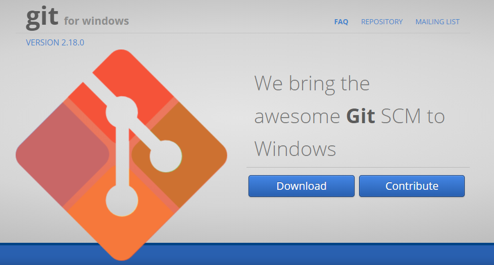

下载最新版本。  我下载的是 2.16.2 

2.下载后, 运行。 可以看到欢迎页面, 如下图所示：

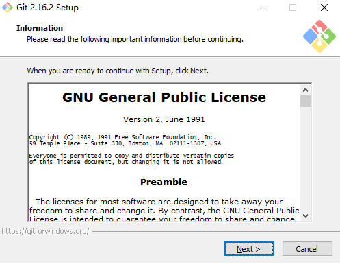

3.选择next, 看到选择安装的内容页面，我们就用默认的就好，如下图所示：

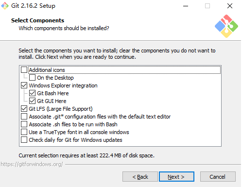

4.选择next, 看到选择哪个编辑器作为git消息编辑器，

我们可以选择下面四个编辑器： 

- nano : 最简单的 Linux 下的编辑器，同 windows下的记事本。 学习曲线是 0 
- vim : 需要用一辈子去学习的编辑器。编辑器之神。 也是我的最爱。
- notepad++ : 加强型记事本。 也很好用。 学习曲线0
- visual studio code: 一款IDE。 

对于新手来说，建议选择 notepad ++, 如下图所示： 

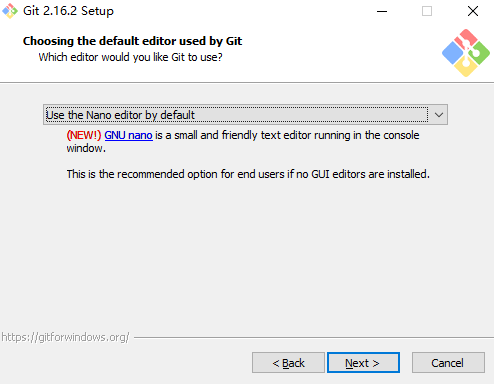	

5.选择next, 询问我们使用什么风格的命令行。 

这里建议使用默认的 “Windows Command Prompt ”就好了。  如下图所示：

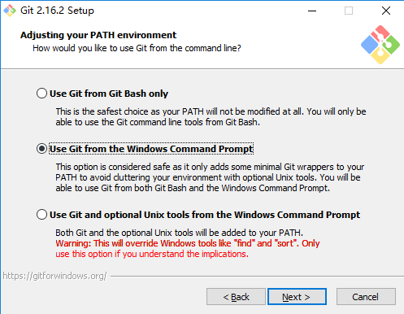	

6.选择next, 询问我们使用什么风格的SSH连接程序。   

- OpenSSH  SSH的首选  ， 这个是Git bash 自带的。 
- Plink    第三方用户自己安装的SSH连接程序。

如下图所示：

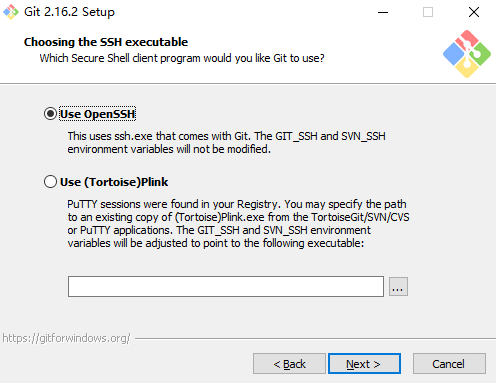	

7.选择next, 询问我们使用什么SSH 后端。  仍然选择默认的 OpenSSL.  如下图所示：

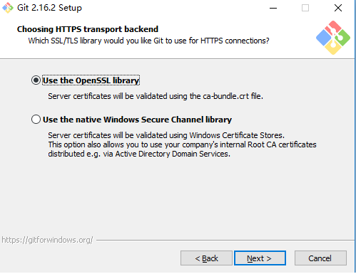	

8.选择next, 询问我们使用什么 checkout/commit 风格。 

因为windows跟linux 对待文件的处理是不同的， 例如回车在windows下是 \r\n, 而在linux下就是 \n .  

所以，我们这里就选择默认的第一项就好（用windows风格checkout, 用unix 风格commit) 。 如下图所示： 

	

9.选择next, 询问我们用什么风格的console. （命令行）

这里一定要选择 "MinTTY" ，也就是类似于 Linux风格的命令行。  可以说，它就是非常著名的 Cygwin. 

如下图所示：

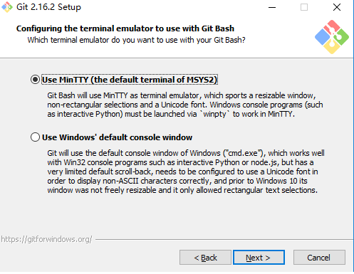	

10.选择next, 询问其他配置项目。 直接选择默认就好，如下图所示： 

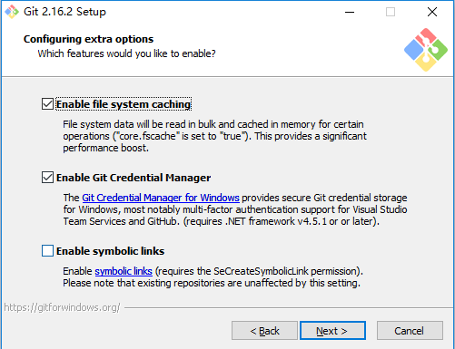	

接下来我们就一路next  下去。就可以安装成功了。 如下图所示： 

	

## 使用 Git Bash

1.打开git bash

我们打开 "Git Bash" ， 可以看到这个页面, 如下图所示： 

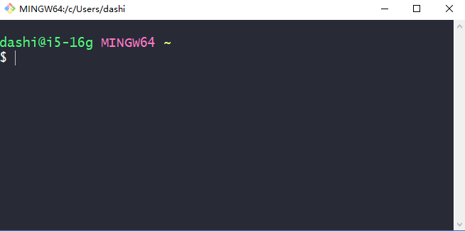	

一片空荡荡。 估计习惯了鼠标和我的电脑的同学会非常不习惯。 不要紧。 我们慢慢来。 

2.查看当前路径：  pwd

输入 `$ pwd ` 就可以知道当前位置了。

```
dashi@i5-16g MINGW64 ~
$ pwd
/c/Users/dashi
```

在上面的结果中可以看到，  

- `dashi` 是我的window 系统的用户名 . (我的外号叫大师。 )
- `i5-16g` 是我的电脑在局域网的名字
- `MINGW64` 是操作系统的名字。 可以认为它是跟 Linux, Windows, Mac之外的第四种操作系统。
- `$` 是命令行的前缀。 后面的 `pwd` 就是我们输入的命令。
- `/c/Users/dashi` 就是当前位置。 这个是 Linux风格。 实际上它对应的 windows的标准路径是： `C:\Users\dashi`

git bash 每次打开的时候，都是默认的这个“当前用户在windows”中的用户文件夹。 

我们在一个窗口中打开 这个路径的话，就可以看到我的用户文件夹了。 如下图所示： 

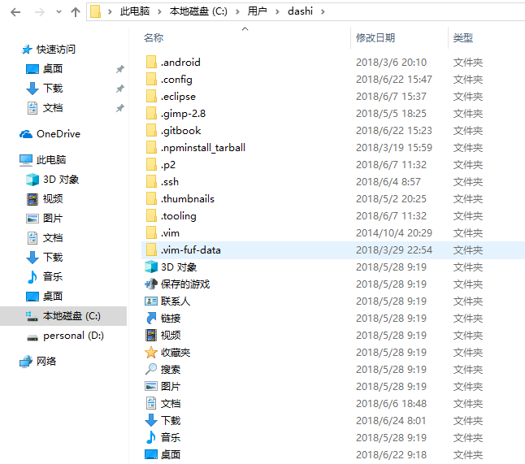

可以看到， 我输入的路径是：`C:\Users\dashi`, 结果在GUI中显示的文字是： "> 此电脑 > 本地磁盘(C:) > 用户 > dashi"

3.切换路径:  cd

例如，我想进入到我的工作目录(位于 D:\workspace\happy_book_vuejs) ，继续写我的vuejs书，就可以这样： 

```
dashi@i5-16g MINGW64 ~
$ cd /d/workspace/happy_book_vuejs/                     

dashi@i5-16g MINGW64 /d/workspace/happy_book_vuejs (master)
$
```

所以，大家可以看到， `D:\` 在 Git bash 中对应的地址是： `/d`  

这个就是唯一需要注意的点了。 

其他的git 的基本知识( `git clone`, `git commit`, `git push`等) 就不在本书中赘述了。 对于没有掌握的同学，一定要赶紧学习这个技术。

