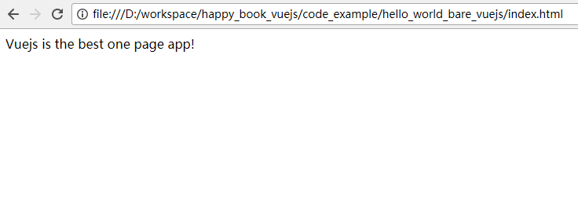

# 急速入门

如果只从体验的角度来看， Vuejs 的安装非常简单. 只需要引入一个第三方的js包即可。

```
<script src="https://cdn.jsdelivr.net/npm/vue@2.5.16/dist/vue.js"></script>
```

下面是一个最简单的例子： 

```
<html>
<head>
	<script src="https://cdn.jsdelivr.net/npm/vue@2.5.16/dist/vue.js"></script>
</head>
<body>
	<div id='app'>
		{{ show_my_text }}
	</div>
	<script>
		var app = new Vue({
			el: '#app', 
			data: {
				show_my_text: 'Vuejs is the best one page app!'
			}
		})
	</script>
</body>
</html>

```

上面的代码非常简单， 

1. 在head中引入 vuejs 包
2. 在<body> 中，定义了一个 <div id='app'></div>, 可以认为，所有的页面展示，都是在这个<div>中。  
	每次我们做任何点击的时候， 整个页面不会刷新， 都是vuejs框架操作代码，对<div id='app'>中的内容进行局部刷新。
3. 后面的  `var app=new Vue...` 这里就是真正的操作代码： 
```
		var app = new Vue({    // 表示创建了一个Vue对象
			el: '#app',        // 指定 所有的 代码操作，都是对于 <div id='app' > 的元素来操作的
			data: {            // data 表示为 Vuejs 管理的变量赋值。 这个变量的名字是 show_my_text
				show_my_text: 'Vuejs is the best one page app!'
			}
		})
```

使用浏览器打开这个页面后， 就可以看到： 




## 源代码

可以在 code_example/hello_world_bare_vuejs 中看到。 并直接运行. 