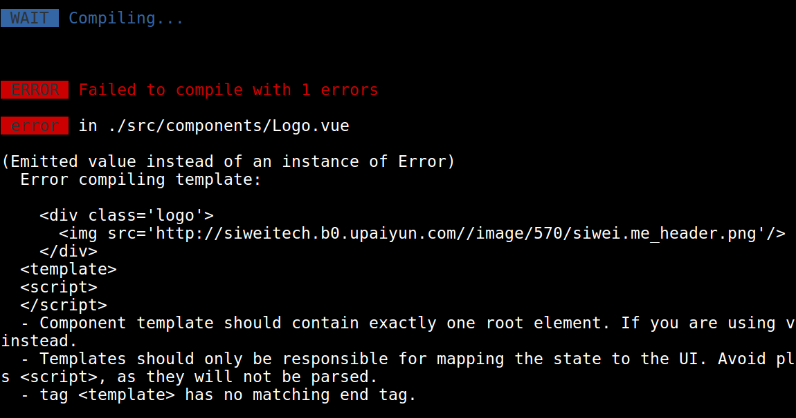
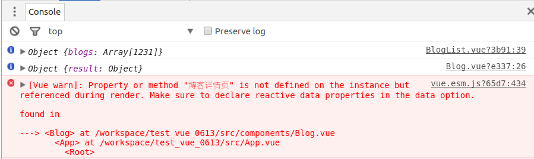
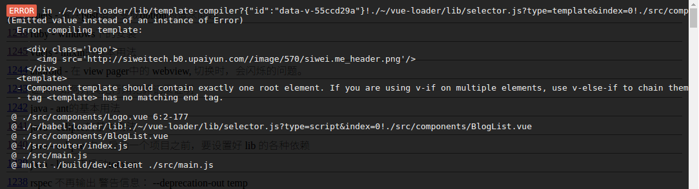

# 如何Debug

浏览器环境下的javascript, 实际上有两个天生缺陷：

1. 不严谨. 不同浏览器的js实现上会略有不同. 这个问题在android, ios上也一样.
2. 不是严格意义上的计算编程语言. 有语法漏洞. 例如 ==

所以, 我们要驾驭好JS语言,就要知道如何有效的Debug.

## 时刻留意 vue server

我们开发时的命令:

```
$ npm run dev
```

会开启一个"开发服务器", 这个开发服务器的后台,我们要时刻留意输出.
有时候我们把代码写错了, 导致Vuejs无法编译, 前台就会一片空白, 还没有任何出错提示.



上面的错误提示很好理解,说 "编译时出现错误",也给出了错误的详细位置.

## 看developer tools 提出的日志

无论是 chrome, safari 还是firefox, 以及  IE 7+ , 都带有这个工具. 特别好用. 任何时候
页面空白了,都要首先看它, 而不是问别人: "页面怎么不动了?"

由于JS代码不是特别严谨, 所以给出的错误提示也都很概括.我们可以做个对比:

- JSP  错误可以精确到某行
- PHP  错误可以精确到某行
- Rails 错误可以精确到某行
- Vuejs, Angular, Titanium 等JS框架: 错误可以精确到 "某个文件".

这是由于, 所有的JS框架的表现层, 都是"框架怪胎", 是一种跟js语言环境妥协的代码.
出了问题很难定位到最底层的根源.

而 JSP, PHP, Rails ERB, 则是 "正常框架", 出了问题可以直接找到最底层.

所以,我们要有一定的经验来Debug. 来理解错误日志.

例如下图:



```
vue.esm.js?65d7:434 [Vue warn]: Property or method "博客详情页" is not defined on the instance but referenced during render. Make sure to declare reactive data properties in the data option.

found in

---> <Blog> at /workspace/test_vue_0613/src/components/Blog.vue
       <App> at /workspace/test_vue_0613/src/App.vue
         <Root>
```

- `vue.esm.js?65d7:434` 表示错误的来源. 这个文件一般人不知道来自于哪里, 我们暂且认为它来自于
临时产生的文件,或者虚拟js机中.
- `Property or method "博客详情页" is not defined ...` 这句话提示了错误的原因.
- `found in ... <Blog> at ...` 这里则是调用栈, 可以看出, 文件是从下调用到最上面的. 问题出在最
上面的文件. 但是没有给出错误的行数.


## 查看页面给出的错误提示(来自于dev server)

如下图:




```
  Error compiling template:

    <div class='logo'>
      
    </div>
  <template>
  <script>
  </script>
  - Component template should contain exactly one root element. If you are using v-if on multiple elements, use v-else-if to chain them instead.
  - Templates should only be responsible for mapping the state to the UI. Avoid placing tags with side-effects in your templates, such as <script>, as they will not be parsed.
  - tag <template> has no matching end tag.
```

这里 `Error compiling template: ` 给出了提示, 错误是由于 模板在被编译时产生的.

下面给出的HTML代码则是出错的点.


```
@ ./src/components/Logo.vue 6:2-177
@ ./~/babel-loader/lib!./~/vue-loader/lib/selector.js?type=script&index=0!./src/components/BlogList.vue
@ ./src/components/BlogList.vue
@ ./src/router/index.js
@ ./src/main.js
@ multi ./build/dev-client ./src/main.js
```

这里是调用栈. 可以看到,出现错误在于 最上面的 Logo.vue, 第六行第二列.
