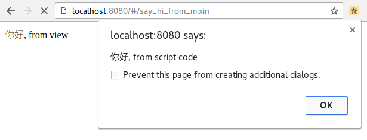

# Mixin

Mixin是一种更好的复用代码的模式.

我们知道 java ,  oc 中的 interface , implements,  extends 等关键字的意义,就是为了让代码可以复用,
可以继承.

但是这几种方法, 都理解起来很不直观, 给人一种拐弯抹角的感觉.

在js, ruby等动态语言中, 我们如果要复用代码的话,直接使用mixin 就好了.

## 建立一个mixin文件

可以在 `src/mixin` 目录下创建, 例如:

文件:  `src/mixin/common_hi.js`:

```
export default {
  methods: {
    hi: function(name){
      return "你好, " + name;
    }
  }
}
```

## 使用

使用起来很简单,在对应的 js文件, 或者 vue文件的`<script>`代码中引用即可.

例如,新建一个vue文件:

`src/components/SayHiFromMixin.vue`, 内容如下:

```
<template>
  <div>
    {{hi("from view")}}
  </div>
</template>

<script>
import CommonHi from '@/mixins/common_hi.js'
export default {
  mixins: [CommonHi],
  mounted() {
    alert( this.hi('from script code'))
  }
}
</script>
```

注意:

- 使用的时候, `mixins: [CommonHi]` 这里的是中括号,表示是数组.
- 在js代码中调用的话, 需要带有this关键字,例如: `this.hi()`

路由如下:

```
export default new Router({
  routes: [
    {
      path: '/say_hi_from_mixin',
      name: 'SayHiFromMixin',
      component: SayHiFromMixin
    }
  ]
} )

```

运行效果如下:


