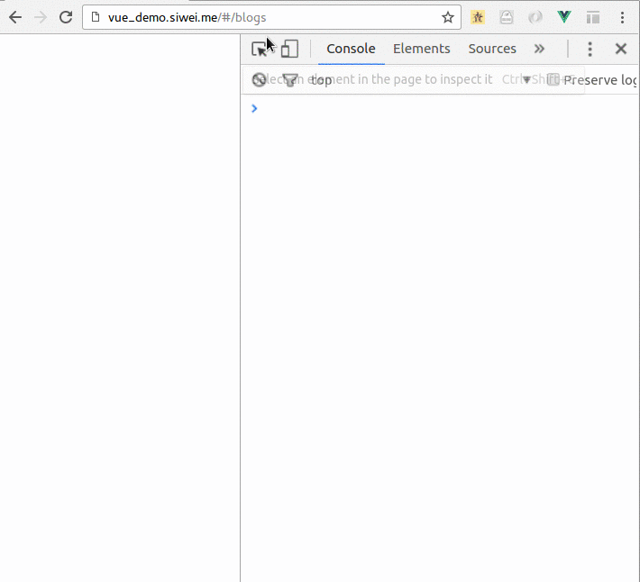
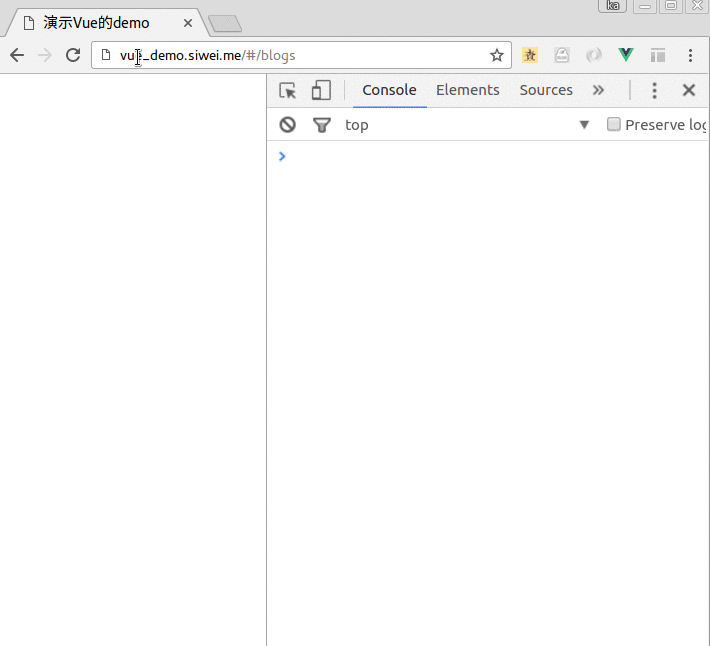

# 解决域名问题与跨域问题

我们在部署之后, 会发现Vuejs会遇到js 的经典问题: 远程服务器地址不对,或者跨域问题.

前提:

我们的真正后台接口是:

`http://siwei.me/interface/blogs/all`

如下:


## 域名404 问题

这个问题看起来如下:



这个问题是由于源代码中,访问 `/interface/blogs/all` 这个接口引起的:

```
this.$http.get('/api/interface/blogs/all')...
```

在我们开发的时候, vuejs 会通过 `$npm run dev` 命令, 跑起一个 "开发服务器",
这个server中有一个代理, 可以把所有的 以 '/api' 开头的请求,例如:

```
localhost:8080/api/interface/blogs/all
```

转发到:

```
siwei.me/interface/blogs/all
```

"开发服务器"的配置如下:

```
proxyTable: {
  '/api': {
    target: 'http://siwei.me',
    changeOrigin: true,
    pathRewrite: {
      '^/api': ''
    }
  }
},
```

所以, 在开发环境下,一切正常.

但是在生产环境中, 发起请求的时候, 就不存在代理服务器,不存在dev server了,所以会出错.

## 跨域问题

这个问题,是js的经典问题.

如果`vue_demo.siwei.me` 直接访问`siwei.me`域名下的资源,会报错.
因为他们是两个不同的域名.

代码形如:

```
this.$http.get('http://siwei.me/api/interface/blogs/all')...
```

我们就会发现:

```
XMLHttpRequest cannot load http://siwei.me/api/interface/blogs/all.
No 'Access-Control-Allow-Origin' header is present on the requested resource.
Origin 'http://vue_demo.siwei.me' is therefore not allowed access.
```

完整过程如下:



