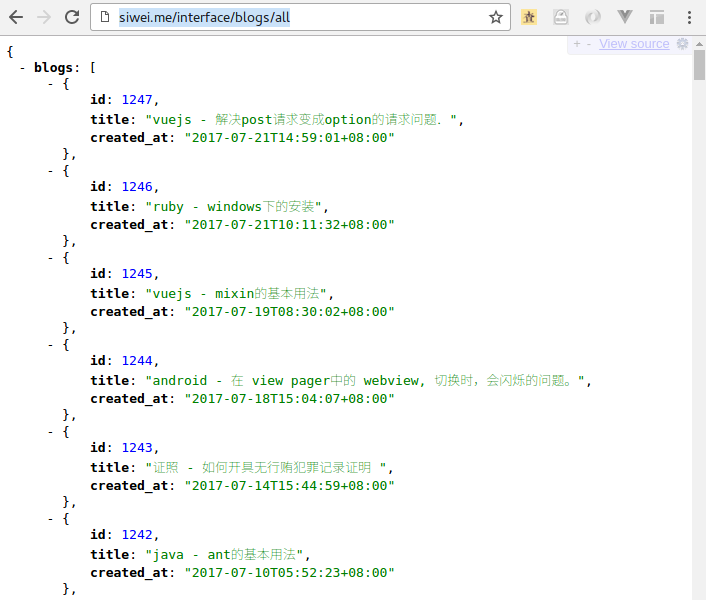
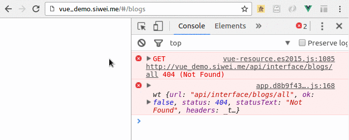
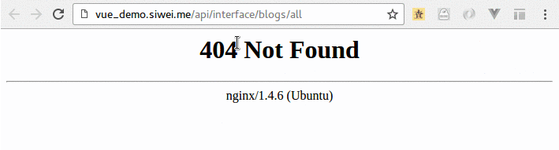
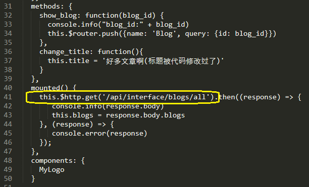
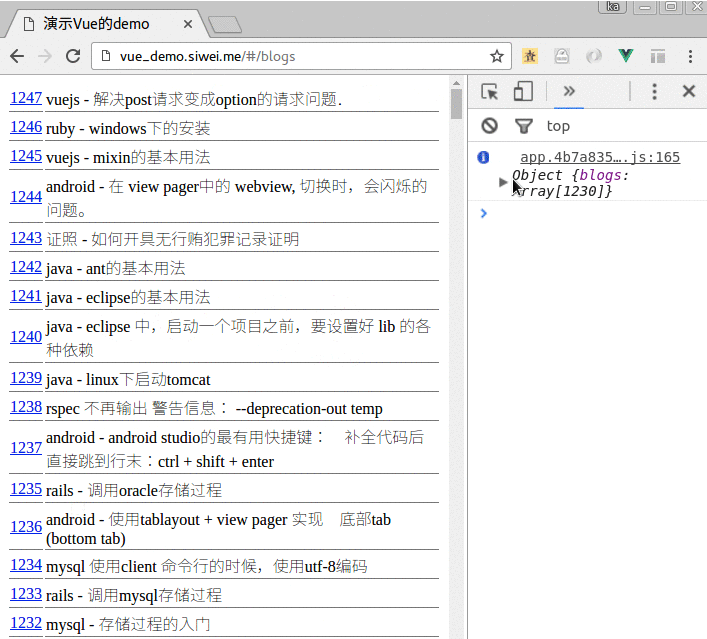

# 解决域名问题与跨域问题

我们在部署之后, 会发现Vuejs会遇到js 的经典问题: 远程服务器地址不对,或者跨域问题.

还是用我们本书中的例子为例。

我们的真正后台接口是:

http://siwei.me/interface/blogs/all

如下:



## 域名404 问题

1.使用浏览器打开页面: http://vue_demo.siwei.me/#/blogs , 页面出错。



2.可以看到，出错的原因是 404, 打开 "http://vue_demo.siwei.me/api/interface/blogs/all"



3.这个问题是由于源代码中,访问 `/interface/blogs/all` 这个接口引起的:

在文件`src/components/BlogList.vue` 中，第41行，我们定义了远程访问的url:  

```
this.$http.get('/api/interface/blogs/all')...
```

如下图所示：




这是因为, 在我们开发的时候, vuejs 会通过 `$npm run dev` 命令, 跑起一个 "开发服务器", 这个server中有一个代理, 可以把所有的 以 '/api' 开头的请求, 如:

```
localhost:8080/api/interface/blogs/all
```

转发到:

```
siwei.me/interface/blogs/all
```

"开发服务器"的配置如下:

```
proxyTable: {
  '/api': {
    target: 'http://siwei.me',
    changeOrigin: true,
    pathRewrite: {
      '^/api': ''
    }
  }
},
```

所以, 在开发环境下,一切正常.

但是在生产环境中, 发起请求的时候, 就不存在代理服务器,不存在开发服务器（dev server）了,所以会出错.

（这个问题的解决办法，我们等下再讲。 ）

## 跨域问题

这个问题,是js的经典问题.

比如，有的同学，在解决上面的问题的时候，会问：老师，我们直接把上图中 41 行的： 

```
this.$http.get('/api/interface/blogs/all')
```

改成： 

```
this.$http.get('http://siwei.me/interface/blogs/all')
```

不就可以了吗？ 

答案是不可以。 请动手试一下再说话。

一动手，我们就会发现，  如果`vue_demo.siwei.me` 直接访问`siwei.me`域名下的资源,会报错.  因为他们是两个不同的域名.

代码形如:

```
this.$http.get('http://siwei.me/api/interface/blogs/all')...
```

我们就会得到报错： 

```
XMLHttpRequest cannot load http://siwei.me/api/interface/blogs/all.
No 'Access-Control-Allow-Origin' header is present on the requested resource.
Origin 'http://vue_demo.siwei.me' is therefore not allowed access.
```

如下图所示：


## 解决域名问题和跨域问题

其实，上面提到的两个问题，根源都是一个。 所以解决办法都是一样的。 

1.在代码端, 处理方式不变, 访问 `/api` + 原接口url。 （无变化）

```
this.$http.get('/api/interface/blogs/all')...
```

2.在开发的时候, 继续保持vuejs 的代理存在. 配置代码如下:  （无变化）

```
proxyTable: {
  '/api': {
    target: 'http://siwei.me',
    changeOrigin: true,
    pathRewrite: {
      '^/api': ''
    }
  }
},
```

3.在nginx的配置文件中,加入代理:(详细说明见代码中的注释)  (这个是新增的)

```
  server {
    listen       80;
    server_name  vue_demo.siwei.me;
    client_max_body_size       500m;
    charset utf-8;
    root /opt/app/vue_demo;

    # 第一步,把所有的 mysite.com/api/interface  转换成:   mysite.com/interface
    location /api {
      rewrite    ^(.*)\/api(.*)$    $1$2;
    }

    # 第二步，　把所有的 mysite.com/interface 的请求，转发到 siwei.me/interface
    location /interface {
      proxy_pass          http://siwei.me;
    }
  }

```

就可以了．

也就是说，　上面的配置，把　

```
http://vue_demo.siwei.me/api/interface/blogs/all
```

在服务器端的nginx中做了个变换，相当于访问了：

```
http://siwei.me/interface/blogs/all
```

重启nginx ,　就会发现生效了．

如下所示：


