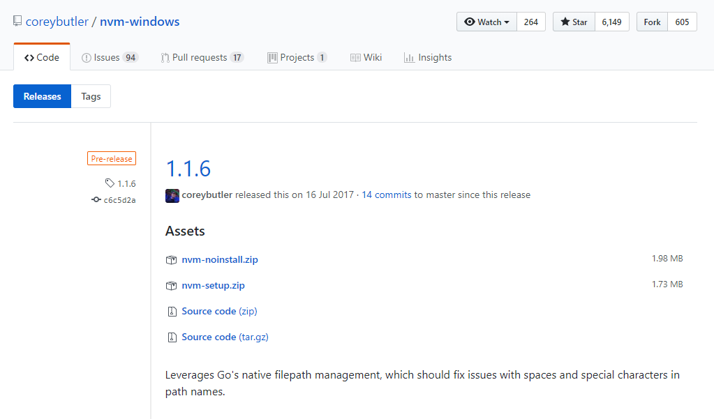
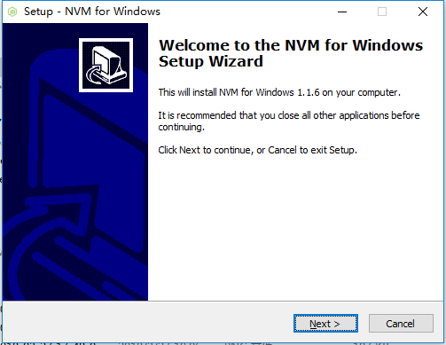
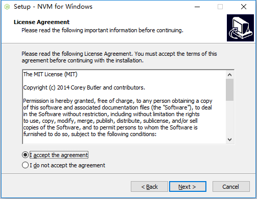
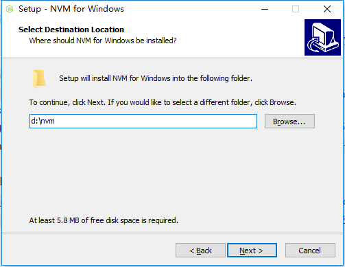
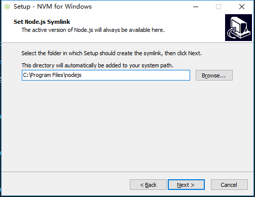
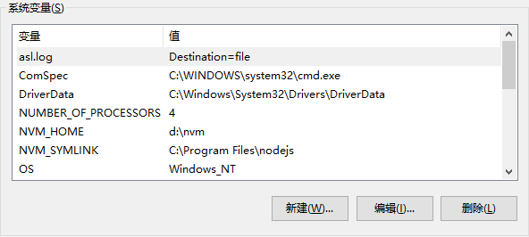
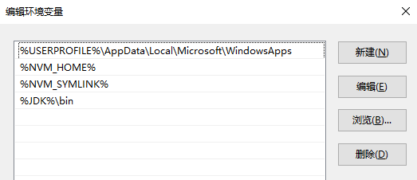

# NVM， NPM 与 Node

NVM, 全名为"Node Version Manager", 是非常好用的Node版本管理器。 

这个技术出现的原因，是因为很多时候，我们的不同的项目，node版本是不同的。 有的是 `5.0.1`, 有的是 `6.3.2`

如果node版本不对的话，运行某个应用时，很可能会遇到各种莫名其妙的问题。 

所以，我们需要在同一台机器上，同时安装多个版本的node .  所以NVM应用而生，很好的帮我们解决了这个问题。

Linux/Mac下的NVM官网：https://github.com/creationix/nvm 

Windows下的NVM官网： https://github.com/coreybutler/nvm-windows

NPM, 全名为"Node Package Manager". 是只要安装了node, 就会捆绑安装这个命令。它的作用跟"ruby中的 bundler", "java中的maven"相同，
都是对第三方依赖进行管理的。


## 安装

### Windows 下的安装： 

1.用浏览器打开：  https://github.com/coreybutler/nvm-windows/releases



2.点击最新的release版本下载。 例如上图中的 "1.1.6 中的nvm-setup.zip" 文件。

3.下载后，解压缩这个`.zip`文件，双击其中的`nvm-setup.exe`文件，就可以开始我们的安装了。如下图：



4.点击下一步，选择接受，如下图所示：



5.继续下一步，选择安装路径。在我的机器上，我把它安装到 `D:\nvm`. 如下图所示：



6.继续下一步，询问我们把nvm这个命令的快捷方式放在哪里。（symlink的作用同快捷方式，允许我们在任意路径下都可以调用nvm命令）

不用修改，直接下一步，如下图所示: 



7.然后会弹出确认安装页面。我们继续点击下一步就可以了。

8.最后，设置环境变量：

```
NVM_HOME 		D:\nvm
NVM_SYMLINK     C:\Program Files\nodejs
```

对于环境变量的修改： 从控制面板中，进入到 “所有控制面板项目” -> “高级系统配置” -> “环境变量”. 如下图所示：



对于PATH的修改，则是在原有的值的基础上，添加"%NVM_HOME%, %NVM_SYMLINK%", 如下图所示： 



### Linux,Mac下的安装：

1.下载nvm的源代码。 运行下面命令即可。

```
$ git clone https://github.com/creationix/nvm.git ~/.nvm && cd ~/.nvm && git checkout `git describe --abbrev=0 --tags`
```

2.Linux, Mac的用户：为脚本设置启动时加载（对于使用windows的同学，可以直接无视第二步，到官网下载exe安装文件就可以了）.

把下面这行代码放到： `~/.bashrc`, 或  `~/.bash_profile`, 或 `~/.zshrc` 中。

```
$ source ~/.nvm/nvm.sh
```

## 运行

注意： 不能使用 `$ which nvm` 来验证安装是否成功。因为即使成功了也不会返回结果。

直接在命令行下， 输入 

```
$ nvm 
```

就可以了。  如果安装成功的话，会看到一些英文。如下所示：

```
Running version 1.1.6.

Usage:

  nvm arch                     : Show if node is running in 32 or 64 bit mode.
  nvm install <version> [arch] : The version can be a node.js version or "latest" for the latest stable version....
  nvm list [available]         : List the node.js installations. Type "available" at the end to see what can be ...
  nvm on                       : Enable node.js version management.
```

## 使用NVM 来安装或者管理node版本

1.列出所有可以安装的node版本：

windows 下的命令：   

```
$ nvm list available
```

Linux/Mac下的命令： 

```
$ nvm list-remote
```

就可以看到可以安装的所有版本. (下面是Windows中的例子。 Linux,mac下的也非常类似）：  

```
$ nvm list available

|   CURRENT    |     LTS      |  OLD STABLE  | OLD UNSTABLE |
|--------------|--------------|--------------|--------------|
|    10.5.0    |    8.11.3    |   0.12.18    |   0.11.16    |
|    10.4.1    |    8.11.2    |   0.12.17    |   0.11.15    |
|    10.4.0    |    8.11.1    |   0.12.16    |   0.11.14    |
|    10.3.0    |    8.11.0    |   0.12.15    |   0.11.13    |
|    10.2.1    |    8.10.0    |   0.12.14    |   0.11.12    |
|    10.2.0    |    8.9.4     |   0.12.13    |   0.11.11    |
|    10.1.0    |    8.9.3     |   0.12.12    |   0.11.10    |
|    10.0.0    |    8.9.2     |   0.12.11    |    0.11.9    |
|    9.11.2    |    8.9.1     |   0.12.10    |    0.11.8    |

This is a partial list. For a complete list, visit https://nodejs.org/download/release
```

2.列出本地安装好了的版本：

```
$ nvm list
```

结果形如： 

```
$ nvm list

  * 10.5.0 (Currently using 64-bit executable)
    6.9.1
```

在上面的结果中，表示当前系统安装了两个node版本，一个是 "6.9.1" , 一个是 "10.5.0" . 默认的node版本是 "10.5.0"

3.安装

选择一个版本号，就可以安装了。  wind

```
$ nvm install 10.5.0  
```

安装好之后，退出命令行并重新进入即可。 

4.使用

下面的命令，是为当前文件夹指定 node 的版本。

```
$ nvm use 10.5.0 
```

对于Linux, Mac, 如果希望为系统全局都使用某个版本，就可以运行下面的命令：

```
$ nvm alias default 10.5.0 
```

在Linux, Mac下，还可以把它放到 `~/.bashrc` 或者 `~/.bash_profile`中。 这样系统每次启动，都会自动指定node作为全局的版本。

## 删除NVM

对于Linux, Mac, 直接手动删掉对应的配置文件（如果有的话）即可。

- `~/.nvm`
- `~/.npm` 
- `~/.bower` 

对于Windows, 则直接在控制面板中卸载软件就可以。 

## 对于国内用户，加快 NVM 和 NPM 下载速度的办法

由于某些原因，在国内连接国外的服务器会比较慢，所以我们使用下面的命令，就可以在国内的镜像服务器下载node了。 感谢淘宝提供~ 

对于NVM (安装不同的node时使用）, 使用 `NVM_NODEJS_ORG_MIRROR` 这个变量作为前缀。

```
$ NVM_NODEJS_ORG_MIRROR=https://npm.taobao.org/dist nvm install
```

对于NPM (安装某些npm第三方包时使用), 则用cnpm代替 npm 命令。 

```
$ npm install -g cnpm --registry=https://registry.npm.taobao.org
```

对于Linux, Mac用户，可以通过直接创建一个 "alias" 命令： 

```
alias cnpm="npm --registry=https://registry.npm.taobao.org \
--cache=$HOME/.npm/.cache/cnpm \
--disturl=https://npm.taobao.org/dist \
--userconfig=$HOME/.cnpmrc"
```

然后，就可以通过国内的淘宝服务器来安装node的包了，例如：

```
$ cnpm install vue-cli -g
```