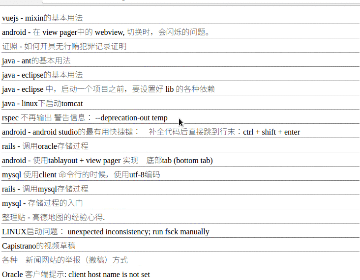
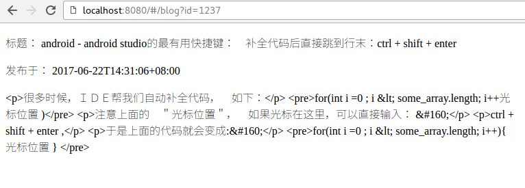
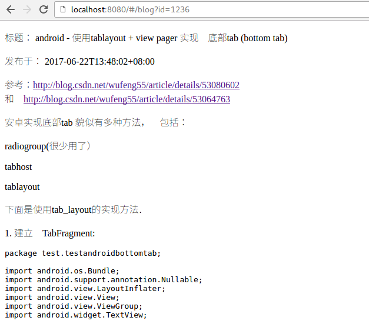

# 不同页面间的参数的传递

在普通的web开发中，参数传递有这么几种形式：

1. url:   `/another_page?id=3`
2. 表单: `<form>...</form>`

在vuejs中，不会产生表单的提交（这会引起页面的整体刷新）.　所以有两种：

1. url ．　同传统语言．
2. vuejs 内部的机制．（无法在url 中体现，可以认为是由js代码隐式实现的）

我们用一个实际的例子说明．


我们之前实现了　＂博客列表页＂，接下来我们要实现：点击博客列表页中的某一行，就显示博客详情页．

## 现有的接口

http://siwei.me/interface/blogs/show?id=1244

```
{
    "result":{
        "body":"<p>这个问题很常见，解决办法就是禁止硬件加速...</p>",
        "id":1244,
        "title":"android - 在 view pager中的 webview, 切换时，会闪烁的问题。"这个问题很常见，解决办法就是禁止硬件加速...</p>
    }
}
```

## 新增Vue 页面：博客详情页．

我们新增Vue页面：  `src/components/Blog.vue`, 用于显示博客详情．

```
<template>
  <div >
    <div>
      <p> 标题： {{ blog.title }}  </p>
      <p> 发布于： {{blog.created_at }}</p>
      <div>
       {{ blog.body }}
      </div>
    </div>
  </div>
</template>

<script>
export default {
  data () {
    return {
      blog: {}
    }
  },
  mounted() {
    this.$http.get('api/interface/blogs/show?id='+this.$route.query.id).then((response) => {
       this.blog = response.body.result
    }, (response) => {
       console.error(response)
    });
  }
}
</script>

<style>
</style>
```

上面代码中:

- `data(){ blog: {}}` 用来初始化 blog这个页面用到的变量.
- \{\{blog.body}}, \{\{blog.title}} 等, 用来显示blog相关的信息.
- `mounted...` 中,定义了发起http的请求.
- `this.$route.query.id` 获取url 中的id参数. 例如:   `/my_url?id=333` , 那么 '333' 就是取到的结果.

## 新增路由

修改 ： `src/router/index.js`

```
export default new Router({
  routes: [
		// ...
    {
      path: '/blog',
      name: 'Blog',
      component: Blog
    }
  ]
} )
```

## 修改博客列表页--跳转方式1: 使用事件

我们需要修改博客列表页, 增加跳转事件:


```
<template>
  ...
      <tr v-for="blog in blogs">
        <td @click='show_blog(blog.id)'>{{blog.title }}</td>
      </tr>
  ...
</template>
<script>
export default {
  methods: {
    show_blog: function(blog_id) {
      this.$router.push({name: 'Blog', query: {id: blog_id}})
    }
  }
}
</script>
```

在上面代码中,

- `<td @click='show_blog(blog.id)'...` 表示, 该`<td>`标签在被点击的时候,会触发一个事件: `show_blog`
并且以当前正在遍历的 blog对象的id 作为参数.
- `methods: {}` 是比较核心的方法,  vue页面中用到的事件,都要写在这里.
- `show_blog: function...` 就是我们定义的方法.该方法可以通过`@click="show_blog" `来调用.
- `this.$router.push({name: 'Blog', params: {id: blog_id}})`中:
  - `this.$router` 是vue的内置对象. 表示路由.
  - `this.$router.push` 表示让vue跳转. 跳转到 name: Blog 对应的vue页面. 参数是 id: blog_id .


## 演示

下图是在博客列表页，点击之后，跳转到　博客详情页的ＧＩＦ动画.



## 不经过HTML转义,直接打印结果.

我们发现，ＨＴＭＬ的源代码在页面显示的时候被转义了，如下:



所以，我们把它修改一下,不要转义:

```
<template>
   .....
      <div v-html='blog.body'>
      </div>
   .....
</template>
```

上面的 `v-html` 就表示不转义.

效果如下图:



## 修改博客列表页--跳转方式2: 使用v-link

参考: https://router.vuejs.org/zh-cn/api/router-link.html

`<router-link>` 比起写死的 `<a href="...">` 会好一些，理由如下：

无论是 HTML5 history 模式还是 hash 模式，它的表现行为一致，所以，当你要切换路由模式，或者在 IE9 降级使用 hash 模式，无须作任何变动。

在 HTML5 history 模式下，router-link 会拦截点击事件，让浏览器不再重新加载页面。

当你在 HTML5 history 模式下使用 base 选项之后，所有的 to 属性都不需要写（基路径）了。

```
<td>
  <router-link :to="{name: 'Blog', query: {id: blog.id}}">
    {{blog.id}}
  </router-link>
</td>
```

然后,就可以看到,生成的HTML形如:

```
<a href="#/blog?id=1239" class="">
	1239
</a>
```

点击之后,有同样的跳转功能.
