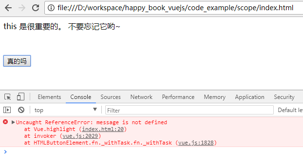

# js的作用域 与 this

无论是 javascript, 还是 emscript, 变量的作用域都属于高级知识。 我们想考察一个js程序员的水平如何，可以直接用作用域来提问。 

同时，我们在实际的开发中发现，很多js/emscript 的新人，对于作用域和 this 都很含混，所以这里要单独的提一下。

## 作用域

无论是 javascript, 还是 emscript, 对于作用域的使用基本是一样的。 后者更加严密一些。 我们看几个例子。

1.全局变量, 可以直接引用。 

```
//全局变量 a:
var a = 1;
function one() {
  console.info(a) 
}
```

打印结果是 1 

2.函数内的普通变量

```
function two(a ){
  console.info('a is' + a)
}
```

运行： 

`two(2)` 打印结果是 ：  `a is 2` 

3.普通函数可以对全局变量做赋值。 如下图所示：

```
var a = 1;
function four(){
  console.info(' in four, before a=4: ' + a)
  if(true) a = 4;
  console.info(' in four, after a=4: ' + a)
}
```

运行： 

```
four(4)
```

结果： 

```
in four, before a=4: 1     ( 这个是符合正常的scope逻辑的。)
in four, after a=4: 4      ( 这个也是符合)
```

再运行： `console.info(a)`, 可以看到输出： `4`  说明 全局变量 `a` 在 four()函数中已经被发生了永久的变化。

4.通过元编程定义的函数

```
var six = ( function(){
  var foo = 6;
  return function(){
    return foo;
  }
}
)();
```

在上述代码中， js解析器会先运行（忽略最后的 `()` )：  

```
var temp = function(){
  var foo = 6;
  return function(){
    return foo;
  }
}
```

然后再运行：  `var six = (temp)()`  ， 所以， `six` 就是：

```
function(){
	return foo;
}
```

上面的 `foo` 就是来自于方法最开始定义的 `var foo = 6`, 而这个变量的定义，是在一个 function() 中的。 所以它不是一个全局变量。  

所以，如果我们在console中输入 `foo` , 会看到报错消息： `Uncaught ReferenceError: foo is not defined`


5.通过元编程定义的函数中的变量，不会污染全局变量。

```
var foo = 1;

var six = ( function(){
  var foo = 6;
  return function(){
    console.info("in six, foo is: " + foo);
  }
}
)();
```

在上面的代码中，我们先定义了一个 全局变量 `foo`, 再定义了一个方法 `six`, 里面定义了一个临时方法 `foo`.   并且进行来了一些操作。 

运行：

```
six()   // 返回：   in six, foo is: 6
foo     // 返回： 1
```


## this

对于 `this` 的使用， 在这里 https://developer.mozilla.org/en-US/docs/Web/JavaScript/Reference/Operators/this  指出了对于javascript中this的详细用法。  

在emscript中也基本是一样的。

简单的说，大家只要记得， `this` 指的是当前作用域的对象实例就好了。

```
var apple = {
  color: 'red',
  show_color: function() {
    return this.color
  }
}
```

我们输入  `apple.show_color` 就可以看到输出 `red`.   这里的 `this` 指的就是 `apple` 变量。


## 实战经验

### 1.在Vue的方法定义中容易用错。

当我们发现 代码看起来没问题， 但是console 总报错说 xx undefined 时， 十有八九就是 忘记加 this 了。

例如： 

```
<html>
<head>
	<script src="https://cdn.jsdelivr.net/npm/vue@2.5.16/dist/vue.js"></script>
</head>
<body>
	<div id='app'>
		{{ message }}
		<br/>
		<button v-on:click='highlight' style='margin-top: 50px'>真的吗</button>
	</div>

	<script>
		var app = new Vue({
			el: '#app', 
			data: {
				message: 'this 是很重要的。 不要忘记它哟~'
			},
			methods:  {
				highlight: function() {
					// 报错：  message is not defined. 
					message += '是的， 工资还会涨~!'

					// 正确的代码应该是：
					// this.message += '是的， 工资还会涨~!'
				}
			}

		})
	</script>
</body>
</html>
```

使用浏览器加载上述代码，我们会发现报错了：



上面的代码中， `message += ...` 那一行中， `message` 是当前的vue的实例的一个"property"(属性)， 而我们如果希望在 `methods` 中引用这个属性的话，
就需要用 `this.message` 才对。 这里的 `this` 对应的就是  `var app = new Vue()` 中定义的 `app`. 

### 2.在发起http请求时容易用错

我们看下面的例子，是一段代码片段：

```
new Vue({
	data: {
		cities: [...]
	},
	methods: {
		my_http_request: function(){
			let that = this
			axios.get('http://mysite.com/my_api.do')
			.then(function(response){
	            // 这里不能使用 this.cities 来赋值
			    that.cities = response.data.result
			})
		}	
	}
})

```

在上面的代码中，我们定义了一个属性： `cities`, 定义了一个方法： `my_http_request`.  该方法会向远程发起一个请求， 
然后把返回的response中的值赋给 `cities`. 

可以在上面代码中看到， 需要先在 `axios.get`之前，定义一个变量 `let that = this`.  这个时候， `this` 和 `that` 都处于 "Vue"的实例中。

但是在 `axios.get(..).then()` 函数中，就不能再使用`this` 了。 因为在 `then(...)` 中，这是个function callback, 其中的 `this` 会代表
这个 http request event. 这是个事件。  

所以， 只能用这样的方式。 

（如果使用了 emscript 的 `=>` 的话，就可以避免上述问题)

### 3.在event handler中容易用错

道理同上。 


