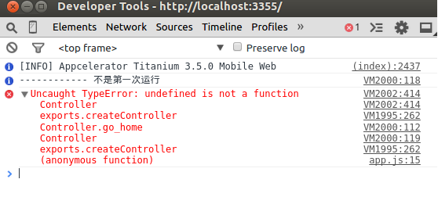
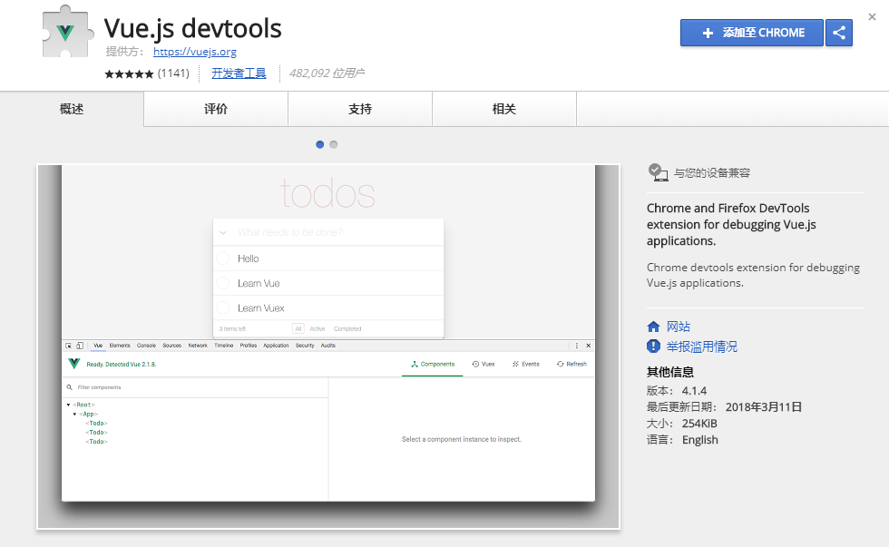
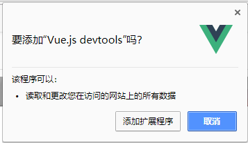
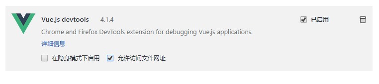
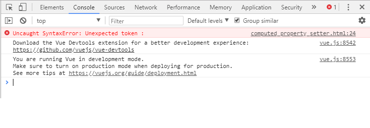
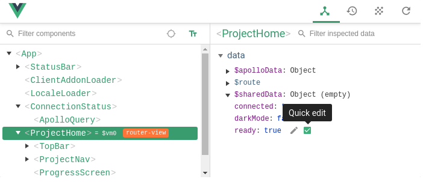

# 安装 Vuejs的开发工具：  vuejs devtool

由于Vuejs是一个框架，它是构建于 javascript 的代码之上，而 javascript 语言的实现并不像其他后端语言（例如 java, python, ruby等） 那样有着对debug友好的错误提示机制。 

这个可以说原因有： 

1. javascript语言是一个非常灵活的语言， 支持 "元编程" ， 而对于任何一个“框架”来说，都会大量的用到 “元编程”的能力。 例如： 

```
var my_code = "var a = 1 + 1; console.info(a) "
eval(some_code)
```

在上面的代码中，  `eval`方法就是一个最典型的 “元编程”方法（meta programming). 说的通俗些， 元编程就是为了“让程序来写程序”。 元编程能力是评估一个语言是否“高级”的一个重要指标。

在带来大量好处的同时， 元编程的缺点是：显示错误信息比较麻烦。 往往显示的错误提示或者stack trace 不是特别明朗。 

2. javascript语言的实现机制， 是在各个不同的浏览器中实现的。 不同的浏览器厂家，都会实现不同的javascript虚拟机（ virtual machine ), 所以，我们往往会发现，一些 javascript的错误
往往是不可读的。例如：



上面出错的原因，就是由于，javascript的代码中，可能会有不同的"scope", 而该浏览器为每个"scope", 都会分配一个 "virtual machine", 所以，上面打印出来的 stack trace , 很忠实的反应出了问题所在， 就是几乎没有可读性。


所以，为了方便我们的开发， 各位同学一定要安装对应的开发组件， 例如：  "Vue.js devtools".  

官方网址：  	https://github.com/vuejs/vue-devtools 

## 安装步骤

非常简单。 建议大家使用chrome， 这样就可以以插件的形式来安装了。

1. 安装chrome 

2. 使用科学上网， 打开： https://chrome.google.com/webstore/detail/vuejs-devtools/nhdogjmejiglipccpnnnanhbledajbpd

3. 就会看到下图：



4. 点击后，会询问是否安装，我们点击"添加扩展程序" 这个按钮就可以了：



5. 就可以看到，浏览器的右上角新增加了灰色的图标。  安装成功。

6. 打开  "设置 " -> '更多工具' -> '扩展程序', 就可以看到刚才安装的Vuejs了，勾选下面的 "允许访问文件网址". 如下图所示：




## 使用步骤

在安装 devtool 之前，我们调试的时候，都是打开浏览器的“开发者工具”， 然后看到的类似下图：



安装好之后，如果你的vuejs 项目是使用 `http` 服务器打开的话， （不是 `file:///...`) 就可以看到了： 


