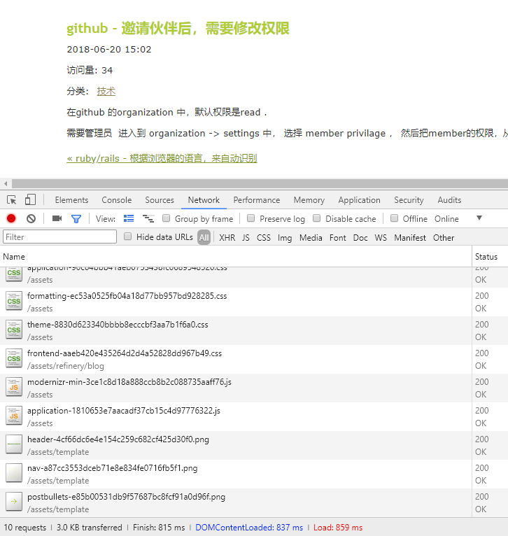

# Single Page App

可以认为，世界上的Web 应用分两类： 

1. 传统Web页面应用
2. 单页应用

## 传统Web页面

就是我们打开浏览器，整个页面都会打开的应用。

例如，我的个人网站 http://siwei.me , 就是一个最典型的“传统Web应用”， 每次点击其中的任意一个链接，都会引起页面的整个刷新。 如下图所示：



从上图中可以看出， 传统的页面，每次打开，都要把页面中所有的 ".js", ".css", 图片文件，html文件等等所有的资源，都要加载一遍。  在 上图中的左下角可以看到，
本次总共加载了 10个请求，(4个css, 2个js, 3个png图片，还有 1个html文件). 耗时 0.837s.

这个在PC端可以， 但是在手机端会巨慢无比。 特别是安卓机。 

传统页面的特点，就是，下面的任何一个操作，都会引起浏览器对于整个页面的刷新：

1. 点击 <link>
2. 提交 <form>
3. 触发 `location.href='...'` 这样的js代码的时候。

我们看个最传统的web页面的例子，如下：

```
<html>
<head>
	<script src="my.js"></script>
	<style src="my.css"></style>
</head>
<body>
	
	<p> 你好！ 传统Web页面！ </p>
</body>
</html>
```

每个浏览器，都会从第一行忠实的解析到最后一行，然后再继续加载  `my.js`, `my.css`, `my.jpg` 这三个外部资源。

其实很好理解。 这个就是大家最初想象的Web页面的打开方式。 

## Single Page App

单页应用，确切的诞生时间不详，可以肯定的是这个概念在2003年就在论坛上被人讨论了。 在2002年四月，诞生了一个网站：http://slashdotslash.com, 就使用了这种思想。

单页应用的精髓，就是点击任何链接，都不会引起页面的整体刷新。 只会通过javascript, 来替换页面的局部内容。

## Ajax : Asynchronous javascript and XML

说到这里，就不得不 提到另一个概念： Ajax. 

中文可以称呼为： js的异步请求。 不过国内统一都叫Ajax.  

Ajax 的概念是： 每次打开新的网页时， 不要让页面整个刷新，而是由"javascript语言", 发起一个 "http 异步请求", 这个“异步请求”的特点，是不会让当前的网页卡死。 

用户可以一边上下滚动页面，播放mp4， 一边等待这个 请求返回数据。 等这个“response” 正常返回后， 由"javascript"控制，来刷新页面的局部内容。

这样的好处是： 

1. 大大节省了页面的整体加载时间。 各种 .js, .css 等资源文件，加载一次就够了。
2. 节省了带宽。
3. 同时减轻了客户端和服务端的负担。   

在智能手机和 App应用（特别是微信）流行起来之后，大量的网页都需要在手机端打开，所以Ajax的优势体现的淋漓尽致。 

虽然Ajax的名字本意是"异步js 与XML"， 不过现在在服务器端返回的数据中，几乎都是使用了"json"， 抛弃了"XML"

在2005年，国内的程序员论坛开始提及Web 2.0, 其中的 Ajax 技术被人重视。 到了 2006年初，可以说Ajax是前端程序员的加薪利器。 市面上的所有“前端Web程序员”职位 都认为
Ajax是一个巨大的加分项。

可惜当时jQuery在国内不是很普及，Prototype也没有流行起来。 我在北京和圈子里的各大公司的同行们交流时，发现大家用的都是“原生的javascript Ajax”。 这种不借助任何第三方框架
的代码写起来非常臃肿，累人，而且考虑到浏览器的兼容问题，应用起来很让人头大。 

例如，当时的代码样子往往是这样的： 

```
var xmlHttp = false;
/*@cc_on @*/
/*@if (@_jscript_version >= 5)
try {
	xmlHttp = new ActiveXObject("Msxml2.XMLHTTP");
} catch (e) {
	try {
		xmlHttp = new ActiveXObject("Microsoft.XMLHTTP");
	} catch (e2) {
		xmlHttp = false;
	}
}
@end @*/
if (!xmlHttp && typeof XMLHttpRequest != 'undefined') {
	xmlHttp = new XMLHttpRequest();
}
```

上面的代码仅仅是为了兼容各种浏览器。 实际上后面还有几十行的冗余代码，才能正式开始干活。

到了2008年，国内开始流行 prototype, jquery之后，发起一个Ajax请求的代码精简成几行：

```
jQuery.get('http://some_url?para=1', function(data){
	// 正常代码
})
```

那时候开始， Ajax在国内变得越来越普及。

### Angular

第一个SPA的知名框架应该是Angular.  由Google在2010年10月推出。 当时的Gmail, google map等应用对于Ajax技术运用到了极致。 而Angular框架一经推出，立刻引燃了单页应用这个概念。

尽管后来各种SPA框架层出不穷，在2015年以前，Angular 稳坐SPA的头把交椅。 

### 当下的SPA技术趋势

成为了项目开发必不可少的内容， 只要有移动端开发，就会面临两个选择：

1. 要么做成原生App
2. 要么做成SPA H5

无论是IOS端还是Android, 都对SPA青睐有加： 

1. 打开页面速度特别快. 

打开传统页面，手机端往往需要几秒，而SPA则在0.x 秒内。

2. 耗费的资源更少.  

因为每次移动端只请求接口数据。和非要不可的图片资源。

3. 对于点击等操作响应更快。  

对于传统页面，手机端的浏览器在操作时，点击按钮的话，往往会有0.1s 的卡顿，而使用SPA则不会有卡顿的感觉。

4. 可以保存浏览的历史和状态。

不是每一个Ajax框架都可以由这一点内容。 例如大家常用的QQ邮箱，虽然也是页面的局部刷新， 但是每次打开不同的邮件时， 浏览器的网址不会变化。 

而在所有的SPA框架中， 都会有专门处理这个问题的模块， 往往叫做“router (路由)”.  

例如： 

`http://mail.my.com/#/mail_from_boss_on_0620`  对应 老板在6月20日发来的邮件。

`http://mail.my.com/#/mail_from_boss_on_0622`  对应 老板在6月22日发来的邮件。 

在2011, 2012年，各种SPA框架出现了井喷的趋势，包括 "backbone" , "ember.js" 等几十上百个不同的框架。 

到了最近几年， Angular, React, Vuejs是三种最流行的框架。 

