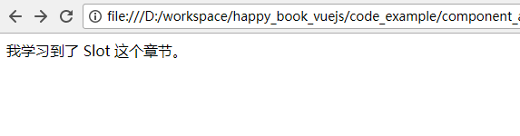

# Slot

作为对Component的补充，Vuejs 增加了 Slot 这个功能. 

## 普通的Slot

我们从具体的例子来说明。

```
<html>
<head>
	<script src="https://cdn.jsdelivr.net/npm/vue@2.5.16/dist/vue.js"></script>
</head>
<body>
	<div id='app'>
		<study-process>
			我学习到了Slot 这个章节。
		</study-process>
	</div>
	<script>
		Vue.component('study-process', {
		  data: function () {
		    return {
		      count: 0
		    }
		  },
		  template: '<div><slot></slot></div>'
		})
		var app = new Vue({
			el: '#app', 
			data: {
			}
		})
	</script>
</body>
</html>
```

从上面的代码从，我们可以看到，我们先是定义了一个 component: 

```
Vue.component('study-process', {
  data: function () {
    return {
      count: 0
    }
  },
  template: '<div><slot></slot></div>'
})
```

在这个component的template中，是这样的：  

```
template: '<div><slot></slot></div>'
```

这里就使我们定义的 slot. 

然后，我们在调用这个 component的时候，这样： 

```
<study-process>
	我学习到了Slot 这个章节。
</study-process>
```		

所以，“我学习到了Slot 这个章节。”就好像一个参数那样传入到了 component中， component 发现自身已经定义了 slot, 就会把这个字符串放到slot的位置，然后显示出来。 

如下图所示： 



## named slot

也就是带有名字的slot . 

很多时候我们可能需要多个slot. 看下面的例子：


```
<html>
<head>
	<script src="https://cdn.jsdelivr.net/npm/vue@2.5.16/dist/vue.js"></script>
</head>
<body>
	<div id='app'>
		<study-process>
			<p slot='slot_top'>
				Vuejs 比起别的框架真的简洁好多！
			</p>

				我学习到了  Slot 这个章节。

			<h5 slot='slot_bottom'>
				再也不怕H5 项目了~ 
			</h5>
		</study-process>
	</div>
	<script>
		Vue.component('study-process', {
		  template: '<div>' + 
		  '<slot name="slot_top"></slot>' + 
		  '<slot></slot>' + 
		  '<slot name="slot_bottom"></slot>' + 
		  '</div>'
		})
		var app = new Vue({
			el: '#app', 
			data: {
			}
		})
	</script>
</body>
</html>
```

上面的代码中， 我们定义了这样的 component: 

```
Vue.component('study-process', {
  template: '<div>' + 
  '<slot name="slot_top"></slot>' + 
  '<slot></slot>' + 
  '<slot name="slot_bottom"></slot>' + 
  '</div>'
})
```

其中的 `<slot name="slot_top"></slot>`  就是一个named slot (具备名字的slot) ,这样，在后面对于 component的调用中：

```
<p slot='slot_top'>
	Vuejs 比起别的框架真的简洁好多！
</p>
```	
就会渲染在对应的位置了。		

## slot 的默认值

我们可以为 slot 加上默认值。这样当 “父页面” 没有指定某个slot的时候，就会显示这个默认值了。

例如：

```
<slot name="slot_top">这里 top slot的默认值 </slot>
```

