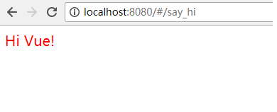

# 使用样式

样式用起来特别简单.  直接写到 `<style>` 段落里面即可. 如下代码所示：

```
<template>
  <div class='hi'>
    Hi Vue!
  </div>
</template>

<script>
export default {
  data () {
    return { }
  }
}
</script>

<style>
.hi {
  color: red;
  font-size: 20px;
}
</style>
```	

用浏览器打开上述代码，就可以看到 一个红色的，字体大小为20px 的 "Hi Vue!". 如下图所示：



## 使用全局

```
<style >
td {
  border-bottom: 1px solid grey;
}
</style>
```

## 使用局部的css

```
<style scoped>
td {
  border-bottom: 1px solid grey;
}
</style>
```
这段CSS只对当前的 component 适用. 

也就是说，当我们有两个不同的页面： page1, page2, 如果两个页面中都定义了某个样式（例如上面的 `td`）的话，是不会互相冲突的。 

因为Vuejs 会这样解析： 

```
page1 的DOM： 
<div data-v-7cfd41e ... ></div>

page2 的DOM: 
<div data-v-3389dfw ... ></div>
```

而我们使用的 "scoped style" ，就可以存在于不同的页面（component)上了！

