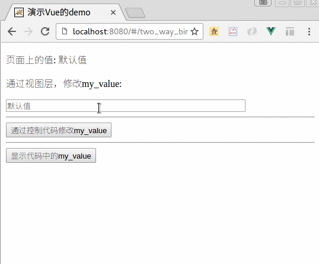
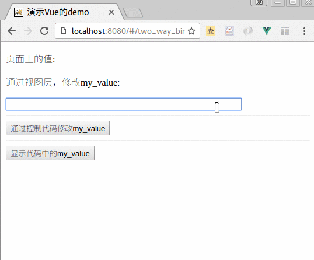

# 双向绑定

双向绑定这个概念现在越来越普及。 

在Angular出现的时候,就作为宣传的王牌概念. 现在几乎是个js前端框架,就有这个功能. 它的概念是:

某个变量，定义于 `<script/>`, 需要展现在 `<template/>`中的话:

1. 如果在代码层面进行修改, 那么页面的值就会发生变化
2. 如果在页面进行修改(例如在input标签中), 那么代码的值就会发生变化.

## 一个演示例子.

在我们的项目中,增加一个 vue页面:  `src/components/TwoWayBinding.vue`

```
<template>
  <div>
    <!-- 显示　this.my_value 这个变量 -->
    <p>页面上的值:  {{my_value}} </p>

    <p> 通过视图层，修改my_value: </p>
    <input v-model="my_value" style='width: 400px'/>

    <hr/>
    <input type='button' @click="change_my_value_by_code()" value='通过控制代码修改my_value'/>
    <hr/>
    <input type='button' @click="show_my_value()" value='显示代码中的my_value'/>
  </div>
</template>

<script>
export default {
  data () {
    return {
      my_value: '默认值',
    }
  },
  methods: {
    show_my_value: function(){
      alert('my_value: ' + this.my_value);
    },
    change_my_value_by_code: function(){
      this.my_value += ",  在代码中做修改, 666."
    }
  }
}
</script>

```

上面的代码中， 显示定义了一个 变量 "my_value"， 这个变量可以在 `<script/>`中访问和修改，也可以在 `<template/>`中访问和修改。 

- 在代码(`<script/>`) 中访问的话，就是 `this.my_value`
- 在视图(`<template/>`)中访问的话，就是 `<input v-model=my_value />`

所以，这个就是双向绑定的方法。

接下来,修改路由文件:  `src/router/index.js`:

```
import TwoWayBinding from '@/components/TwoWayBinding'

export default new Router({
  routes: [
    {
      path: '/two_way_binding',
      name: 'TwoWayBinding',
      component: TwoWayBinding
    }
  ]
})
```

然后, 就可以用浏览器访问路径:　`http://localhost:8080/#/two_way_binding`

效果１：通过页面，修改js代码的值，可以看到，代码中的`my_value`一边， 视图中的`my_value` 就发生变化。 

如下图所示： 



效果２：通过代码层面的改动，影响页面的值. 

如下图所示：



所以，这个特性是Vuejs自带的。我们不需要刻意学它，只需要知道它可以达到这个目的，具备这个特性，就可以了。

以后我们会发现，Vuejs 等前端框架中，这种思想和现象特别常用。
