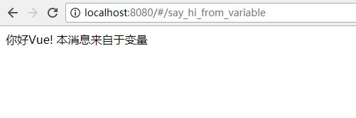

# 视图中的渲染

前面我们介绍了项目的运行（hello world), 文件夹的结构，以及index.html中的内容是如何一点点的渲染出来的。下面，我们来
学习下Vuejs中对于视图的操作。

## 渲染某个变量

假定我们定义了一个变量：　

```
<script>
export default {
  data () {
    return {
      my_value: '默认值',
    }
  },
}
</script>

```

我们就可以这样来显示它：　

```
<div>{{my_value}}</div>
```

完整代码如下： （ `src/components/Hello.vue`) 

```
<template>
  <div>
    {{message}}
  </div>
</template>

<script>
export default {
  data () {
    return {
      message: '你好Vue! 本消息来自于变量'
    }
  }
}
</script>

<style>
</style>
```

可以看到，上面的代码显示定义了 `message` 这个变量， 然后把它在 `<h1> {{ message }} </h1>` 中显示出来。 

打开浏览器  http://localhost:8080/#/say_hi_from_variable , 就可以看到下图所示： 



## 方法的声明和调用

声明一个方法：　show_my_value
```
<script>
export default {
  data () {
    return {
      my_value: '默认值',
    }
  },
  methods: {
    show_my_value: function(){
      // 注意下面的　this.my_value, 要用到this这个关键字．
      alert('my_value: ' + this.my_value);
    },
  }
}
</script>
```

调用上面的方法

```
<template>
  <div>
    <input type='button' @click="show_my_value()" value='...'/>
  </div>
</template>
```

对于有参数的方法，直接传递参数就好了．　例如:

```
<template>
  <div>
    <input type='button' @click="say_hi('Jim')" value='...'/>
  </div>
</template>
<script>
export default {
  data () {
    return {
      my_value: '默认值',
    }
  },
  methods: {
    say_hi: function(name){
      alert('hi, ' + name)
    },
  }
}
</script>
```

上面代码中，

```
<input type='button' @click="say_hi('Jim')" value='...'/>
```

就会调用 `say_hi` 这个方法 , 传入参数　'Jim'。

## 事件处理：　v-on

我们看到，很多时候，　`@click` 等同于 `v-on:click`, 下面两个是一样的：　

```
<input type='button' @click="say_hi('Jim')" value='...'/>
<input type='button' v-on:click="say_hi('Jim')" value='...'/>
```
