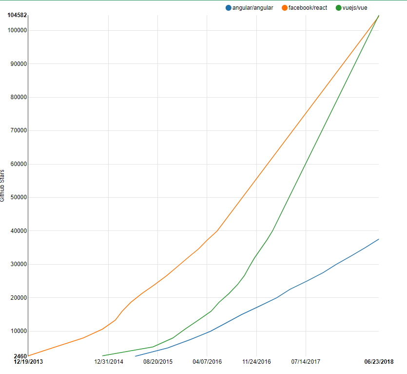

# 知名的单页应用(SPA) 框架对比

在学习Vuejs之前，我们要知道为什么要学习它。 

目前市面上最知名的SPA框架，包括： Vuejs, React, Angular. 我们依次来看一下~


## Angular

作为SPA的老大哥，源于Google, 在过去若干年发挥了巨大的价值。 现在的版本是4.0 

它的优点特点是： 

1. 业内的第一个SPA框架
2. 实现了前端的MVC解耦
3. 双向绑定。  model层的数据发生变化会直接影响View. 反之亦然。

缺点也很明显：  

1. 难学, 难用，
2. Angular 1.x 的文档很烂。 2.0 稍微好一些。 

我个人曾经在13年7月做项目用到它，当时我还服务于优酷. 

angular 1. 它的文档: directive. 被无数人(老外)吐槽: 看不懂. 'The worst document that I've ever read'.  3 个月没变. (记得当时的页面的很多留言都是一年以前的)

文档不全，没有示例代码。很多东西调试起来也没有专门的工具。 

另外，想使用第三方组件的话，需要单独为Angular做适配。 例如 jquery-upload 这个大名鼎鼎的前端上传文件的组件。 用起来非常不好用。

总之，功能很全面，但是由于学习曲线过于陡峭，上手很慢，维护起来麻烦。

所以现在在论坛上的口风开始下降。 

官方网站： https://github.com/angular   截止到 2018.6月下旬， github 关注数 3.8万

## React

由Facebook推出的SPA框架。 是与Vuejs并列的两大框架之一。 宣称的特点“ Learn once, write anywhere” 很吸引人。 

优点：

1. 使用js 一种语言就可以写前端(h5, app) + 后端. 
2. ReactNative 可以直接运行在手机端，性能很棒，接近于原生App.  并且可以热更新， 免去了手机端App每次都要重新下载安装才行。
3. 周边组件很多。

缺点：

1.html代码(<div>这样的标签) 需要写在js 文件中, 例如：

```
class HelloMessage extends React.Component {
  render() {
    return (
      <div>
        Hello {this.props.name}
      </div>
    );
  }
}

ReactDOM.render(
  <HelloMessage name="Taylor" />,
  mountNode
);
```

这样的“多语言混合式编程” 引起的最大特点，是代码难以理解，非常难以开发和调试。  

2.把前后端代码写在一起的风格

`````````````
//前端代码

....


// 后端代码
....

`````````````

所有传统web框架过的人( java, rails, php) 都觉得奇怪. 

其他表现尚可。 学习难度低于 Angular, 但是高于Vuejs.  

官方网站： https://github.com/facebook/react  截止2018年6月底，关注人数是10.4万。 

## Vuejs

Vuejs(读音同 "View") 是一个MVVM (Model - View - ModelView) 的SPA框架。 

- View: 视图
- Model: 数据
- ModelView: 连接View与Model 的纽带

Vuejs一经推出，就获得了各大社区的好评。 几乎是一边倒的声音。 它的优点是：

1.简单好学, 好用.

- Angular: 学习二周到4周
- React:  学习两周
- Vuejs:  三天到一周.

做的事儿都一样. 

2.Angular, React具备的功能， Vuejs都具备。 (React Native 除外)

3.作者尤雨溪（ 个人网站： http://evanyou.me ） 是中国人. 目前在美国google工作

所以Vuejs 在2014年2月推出的时候，核心文档就具备了两种语言:  中文、英文. 这对于母语是汉语的国人来说意义重大。 可以非常快的上手。 

官方网站 https://github.com/vuejs/vue  截止2018年6月底，关注人数10.5万。 是三大框架中的最高者。

## 为什么用vue , 不用 react, angular?

我们在评价一个技术的时候，一个最简单的办法，就是看它有多“火”。 这个体现在Github的 stars 数目上。

截止到 2018年6月底， 三个项目的关注数分别是：

- Angular: 3.8万
- React: 10.4万
- Vuejs: 10.5万

可以看出， Vuejs 第一。

其次，我们看一下 stars 的增长趋势。

根据统计，（http://www.timqian.com/star-history/#facebook/react&angular/angular&vuejs/vue ），截止到2018-6-23, 
github star曲线如下图所示，可以看出， Vuejs 的增长势头一直是最高的, React居中， Angular最低: 



第三，Vuejs的作者就是中国人，官方文档之一就是中文。 （地址： http://cn.vuejs.org ）  这个对于普遍英语水平不好的国人程序员来说，可以非常快的上手，是个巨大的优势。

参考文章：

https://cn.vuejs.org/v2/guide/comparison.html

https://www.quora.com/How-does-Vue-js-compare-to-React-js

