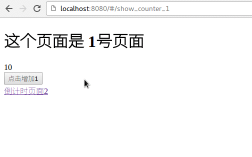

# Vuex

Vuex 是 状态管理工具.

简单的说, Vuex 帮我们管理 "全局变量", 供任何页面在任何时刻使用.

Vuex 非常重要. 不管是大项目还是小项目,都有用到它的时候.  我们必须会用.

完整官方文档:  https://vuex.vuejs.org/zh-cn/getting-started.html   必看.


## 正常使用的顺序

假设,我们有两个页面:  "页面1" 和"页面2" , 共同使用一个变量: counter.  页面1对 "counter" + 1 后,
页面2的值也会发生变化.

### 1.修改`package.json`:

```
  "dependencies": {
    "vuex": "^2.3.1"
  },
```

如果不确定你的 vuex 用什么版本,就先手动安装一下:

```
$ npm install vuex --verbose
```

然后看安装过来的版本号就可以了.

### 2.新建文件:  `src/vuex/store.js`

这个文件的作用,是在整个Vuejs项目中, 声明: 我们要使用Vuex进行状态管理了.

```
import Vue from 'vue'
import Vuex from 'vuex'

// 这个就是我们后续会用到的counter 状态．
import counter from '@/vuex/modules/counter'

Vue.use(Vuex)

const debug = process.env.NODE_ENV !== 'production'
export default new Vuex.Store({
    modules: {
			counter    			// 所有要管理的module, 都要列在这里.
    },
    strict: debug,
    middlewares: []
})
```

在上面代码中,大部分是鸡肋代码. 有用的代码只有:

```
import counter from '@/vuex/modules/counter'
...
	modules: {
		counter
	}
...
```
这里定义了所有的 vuex module.

3.新建文件: `src/vuex/modules/counter.js`

```
import { INCREASE } from '@/vuex/mutation_types'

const state = {
  points: 10
}

const getters = {
  get_points: state => {
    return state.points
  }
}

const mutations = {
  [INCREASE](state, data){
    state.points = data
  }

}

export default {
  state,
  mutations,
  getters
}
```

上面是一个最典型的  vuex module, 它的作用就是计数.

- state: 表示状态. 可以认为state是一个数据库，保存了各种数据。我们无法直接访问里面的数据。
- mutations: 变化。  可以认为所有的state都是由mutation来驱动变化的。 也可以认为它是个setter.
- getter:  取值的方法。  就是getter( 跟setter相对）

我们如果希望"拿到"某个数据，就需要调用 vuex module的`getter` 方法。
我们如果希望"更改"某个数据，就需要调用 vuex module的`mutation` 方法。


4.新增文件: `src/vuex/mutation_types.js`

```
export const INCREASE = 'INCREASE'
```
大家做项目的时候, 要统一把 mutation type定义在这里. 它类似于 方法列表.

5.新增路由: `src/routers/index.js`

```
import ShowCounter1 from '@/components/ShowCounter1'
import ShowCounter2 from '@/components/ShowCounter2'

export default new Router({
  routes: [
    {
      path: '/show_counter_1',
      name: 'ShowCounter1',
      component: ShowCounter1
    },
    {
      path: '/show_counter_2',
      name: 'ShowCounter2',
      component: ShowCounter2
    }
	]
})
```

6.新增两个页面: `src/components/ShowCounter1.vue`
和 `src/components/ShowCounter2.vue`

这两个页面基本一样.

```
<template>
  <div>
    <h1> 这个页面是 1号页面 </h1>
    {{points}} <br/>
    <input type='button' @click='increase' value='点击增加1'/><br/>
    <router-link :to="{name: 'ShowCounter2'}">
          计数页面2
    </router-link>
  </div>
</template>

<script>
import store from '@/vuex/store'
import { INCREASE } from '@/vuex/mutation_types'
export default {
  computed: {
    points() {
      return store.getters.get_points
    }
  },
  store,
  methods: {
    increase() {
      store.commit(INCREASE, store.getters.get_points + 1)
    }
  }
}
</script>
```

可以看出， 我们可以在 `<script>`中调用 vuex的module的方法。 例如：

```
increase() {
	store.commit(INCREASE, store.getters.get_points + 1)
}
```

这里， `store.getters.get_points` 就是通过`getter`获取到 状态“points"的方法。

`store.commit(INCREASE, .. )` 则是 通过 `INCREASE` 这个`action` 来改变 "points"的值。

## Computed属性

Computed 代表的是某个组件(component)的属性, 这个属性是算出来的。 每当计算因子发生变化时，
这个结果也要及时的重新计算。

上面的代码中：

```
<script>
export default {
  computed: {
    points() {
      return store.getters.get_points
    }
  },
</script>
```

就是定义了一个叫做 'points' 的 'computed'属性。 然后，我们在页面中显示这个”计算属性":

```
<template>
  <div>
    {{points}}
	</div>
</template>
```

就可以把 state中的数据显示出来， 并且会自动的更新了。

重启服务器( `$ npm run dev` ) , 之后运行, 可以看到如下图所示:


