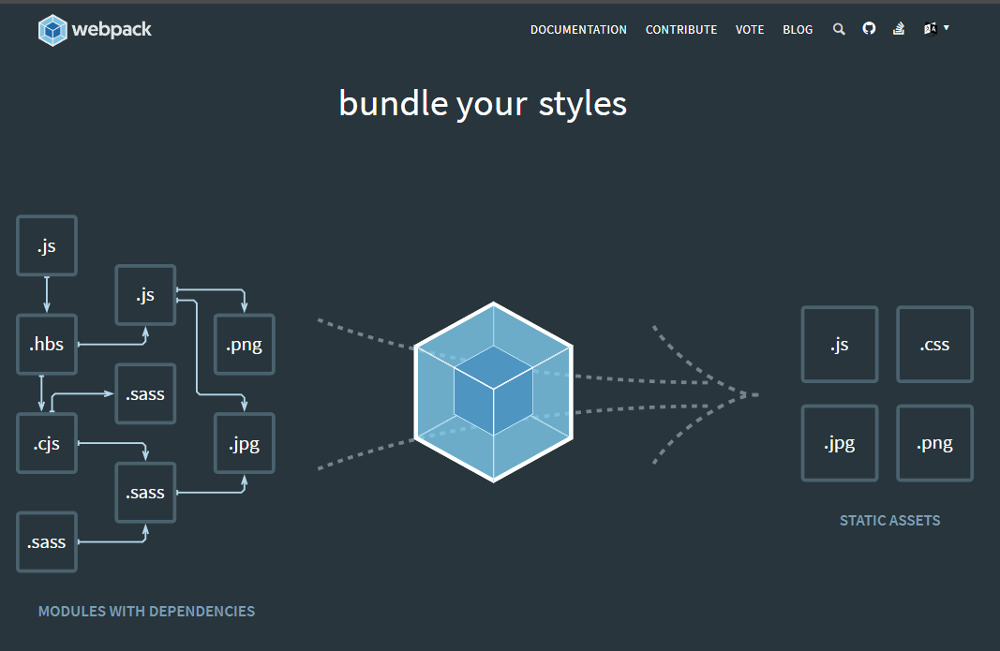

# Webpack

随着 SPA（Single Page App) 单页应用的发展，大家发现，使用的js/css/png等文件特别多。难以管理。文件夹结构很容易混乱。

而且很多时候我们希望项目可以具备： 压缩css, 压缩js, 正确的处理各种js/css的import, 以及相关的模板html文件. 

在最初的一段时间里，可以说每个SPA项目发展到一定规模，就会遇到这样的瓶颈和痛点。

为了解决这个问题，就出现了Webpack. 

官方网站： https://webpack.js.org/   github: https://github.com/webpack/webpack, 截止2018-6-25, 关注数是 41918. 



它是一个打包工具，可以把  js, css, node module, coffeescript, scss/less , 图片等等都打包在一起。 这个简直是模块化开发SPA福音！ 所以现在几乎所有的SPA项目，
所有的JS项目，都会用到Webpack. 

我们在前面的入门中，看到了Vuejs只需要引入一个外部的js文件就可以工作。不过在我们的实际开发中，情况复杂了很多倍。 我们都是统一使用Webpack + Vuejs的方式来做项目的。
这样才可以做到 “视图”， “路由”， “component”等等的分离，以及快速的打包，部署，项目上线。

## 功能

它的功能非常强大，对各种技术都提供了支持，仿佛是一个万能胶水，把所有的技术都结合到了一起：

### 1.对文件的支持

- 支持普通文件
- 支持代码文件
- 支持文件转url （支持图片）

### 2.对JSON的支持

- 支持普通JSON
- 支持JSON5
- 支持CSON

### 3.对JS 预处理器的支持

- 支持普通javascript
- 支持Babel  ( 来使用 ES2015+ )
- 支持Traceur ( 来使用 ES2015+ )
- 支持Typescript 
- 支持Coffeescript

### 4.对模板的支持

- 支持普通HTML
- 支持Pug 模板
- 支持JADE 模板
- 支持Markdown 模板
- 支持PostHTML
- 支持Handlebars

### 5.对Style的支持

- 支持普通style
- 支持import 
- 支持LESS
- 支持SASS/SCSS
- 支持Stylus
- 支持PostCSS

### 6.对各种框架的支持

- 支持Vuejs
- 支持Angular2
- 支持Riot

## 安装方式

```
$ npm install --save-dev webpack
```

## 使用

由于Webpack自身是支持Vuejs的，Webpack 跟 Vuejs 已经结合到很难分清谁是谁，我们就索性不区分。 知道做什么事儿需要运行什么命令就可以了。 

所以我们不必专门来单独学习Webpack，了解Webpack的概念就可以. 

在接下来的教程中，同学会看到Webpack + Vuejs 共同开发的方法和步骤。


