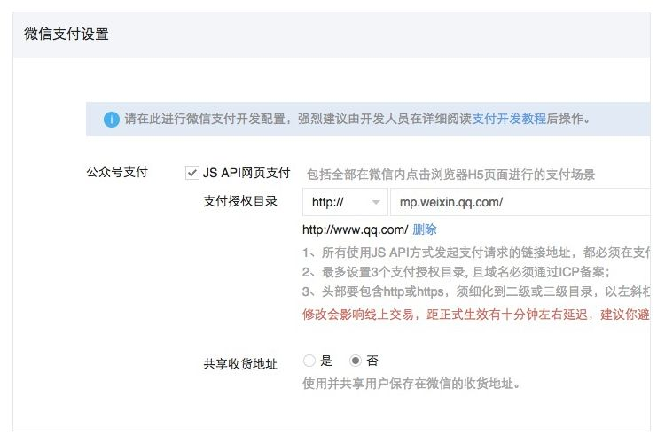

# 微信支付

微信支付，按照微信的官方文档来看不算难。 特别是我们的项目是“传统的WEB项目”的话。 

但是，对于SPA（单页应用）来说，就很坑了。 几乎没有解释，文档也很烂。 

## 优先使用IOS来调试

微信支付带有一个选项，是可以打印出支付过程中的调试信息的。 

但是我们在使用中发现， Android的微信支付错误是不可读的。也就是说，开启debug选项是不可用的。 

但是对于苹果的设备支持的就很好。 所以大家在开发的时候，要先把苹果设备走通。 

## 微信的支付授权目录问题

在生产环境下，微信要求对于支付路径，在微信的管理后台进行配置，如下图所示：

大家要注意，安卓和IOS的配置是不一样的。

安卓： 取支付页面的URL
IOS： 取根路径URL

例如： 根路径是： http://yoursite.com,  支付路径是： http://yoursite.com/#/books/pay?id=3  

那么，在设置 “支付授权目录”的时候， 需要设置两个目录：

一个是  http://yoursite.com/#/        (给IOS)
一个是  http://yoursite.com/#/books/  (给Android)